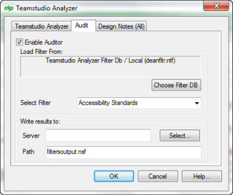
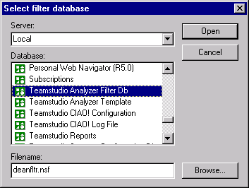
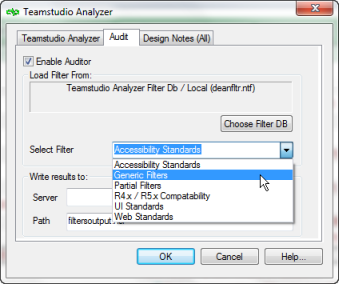

# 設計の監査

**[ 監査 ]** タブの **[ 監査を有効にする ]** チェックボックスをオンにすると、設 計要素が、あらかじめ定義されたフィルタセットに適合しているかどうかテストすることができます。監査結果は、指定した監査結果データベース に書き込まれます。データベースの設計の問題を調査できます。データベースの全設計要素を監査の対象としない場合は、**[Design Notes]** タブで個々の 設計要素を指定してください。

詳細については [Design Notes タブの使用](designtab.md)をご参照ください。

監査機能が実行されるたびに、Analyzer はまず対象となる設計の分析ファ イルを検査し、更新を行います。監査結果文書が生成されると、その文書 は分析データベース内の関連文書にリンクされ、監査で選択された各設計 要素の詳細が全て付与されます。

<figure markdown="1">
  
</figure>

To監査を無効にするには、**[ 監査を有効にする ]** チェックボックスをオフにし ます。

## フィルタデータベースを選択するには
使用するフィルタデータベースは、次のように指定します。

1. **[監査]**タブの**[フィルタDBの選択]**をクリックします。  
   
2. **[ フィルタデータベースの選択 ]** ウィンドウで、**[ 選択 ]** をクリックします。  
   **[開く/参照 ]** ウィンドウが表示されます。
3. 目的のTeamstudio Analyzerフィルタデータベースを選択します。  
   
   

     
Note

     
ノーツのデータベースディレクトリにサンプルフィルタデータベースが インストールされます。

   

4. **[ 開く ]** をクリックし、**[OK]** をクリックします。
5. **[ フィルタセットの選択 ]** ドロップダウンリストから、データベースで実行する フィルタセットを選択します。  
   多くの異なるフィルタセットに対して監査を複数回実行するよりも、パフォー マンス上の問題や基準違反など、目的のフィルタをクラス内で結合して、一度 に処理するようにしてください。  
   
   
クラスおよびフィルタデータベースの詳細については、[Analyzer フィルタ](filters.md)を参照してください。