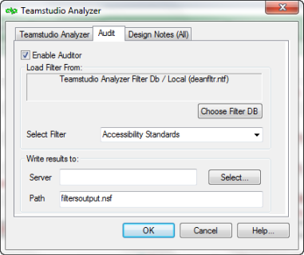
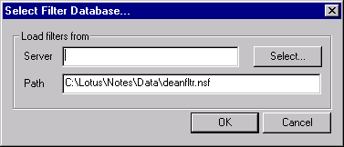
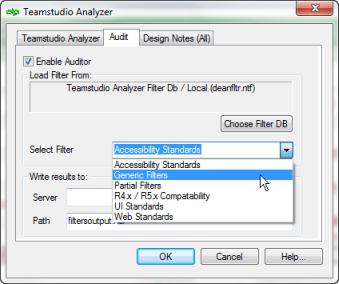

# Auditing a Design

On the **Audit** tab, you can select the **Enable Auditor** check box to have Analyzer determine whether any of your design elements match a pre-defined set of filters. Auditor writes the audit results to an audit output database that you specify. You can investigate issues with the design of your database. If you don’t want Analyzer to check every design element in your database during the audit, specify individual design elements on the **Design Notes** tab.

See also Using the [Design Notes Tab](designtab.md).

Each time you run the audit function, Analyzer first examines and updates the analysis file for the targeted design. When Analyzer generates audit output documents they are linked to the associated documents in the analysis database, providing full details of each design element selected by the audit.

<figure markdown="1">
  
</figure>

To disable Auditor, clear the Enable Auditor check box.

## To select the filter database
You can identify a filter database to use as follows:

1. On the **Audit** tab, click **Choose Filter DB**.  
   
2. On the **Select Filter Database** window, click **Select**.  
   You see the **Open/Browse** window.
3. Select the Teamstudio Analyzer Filter Database you want.  
   
   

     
Note

     
Teamstudio installs a sample filter database in your Notes database directory.

   

4. Click **Open** then click **OK**.
5. From the Select filter dropdown, select the filter set you want to run against your database.  
   Rather than run Auditor multiple times against many different filter sets, you should combine the filters you want (for example, performance problems and standards violations) within a set to be processed together.  
   
   
See also [Analyzer's Filters](filters.md)