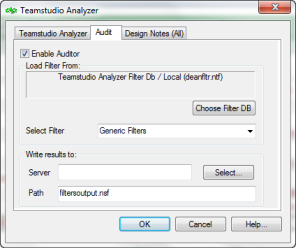

# 監査結果データベースの選択

Analyzer Audit の結果は、指定した監査結果データベースに配置されます。

監査結果データベースは、既存または新規作成のいずれの場合でも、必ず Teamstudio **tmslogs.ntf** テンプレートに基づいています。

## 既存の監査結果データベースを使用するには
1. **[ 選択 ]** をクリックし、**tmslogs.ntf** テンプレートに基づく既存のデータベースの 一覧を表示します。
2. 一覧からデータベースを選択します。
3. **[ 開く ]** をクリックします。

## 新規データベースを作成するには
1. サーバー名、およびパス(監査結果データ ベース名まで含む)を入力します。  
   新規データベースは、自動的に **tmslogs.ntf** テンプレートに基づいて作成され ます。  
   
 
デフォルトでは、データベースの全設計要素が分析されます。全設計要素を監 査の対象としない場合は、分析する個々の要素を [Design Notes] タブで指定し ます。

詳細については[設計ノートタブの使用](designtab.md) を参照してください。

**[ 監査を有効にする ]** チェックボックスをオンにして、フィルタセットを選択し ます。結果データベースを指定したら、データベースの分析を開始します。
 
!!! note
    Analyzer を実行しないと、監査機能は実行できないので注意してくださ い。[Teamstudio Analyzer] タブで **[OK]** をクリックすると、Analyzer Audit が起動し、データベース設計の分析も実行されます。**[Design Notes]** タブで選択した監査の対象となる設計要素サブセットも同時に分析対象となります。
    
すぐに処理を開始する場合は、[分析の開始](startinganalysis.md) を参照してください。