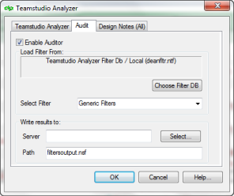

# Selecting an Audit Output Database

Analyzer Audit places its results in the audit output database you designate.

The audit output database is always based on Teamstudio’s **tmslogs.ntf** template, whether you select an existing output database or create a new one.

## To use an existing output database
1. Click **Select** to display a list of existing databases that are based on the **tmslogs.ntf** template.
2. Select a database.
3. Click **Open**.

## To create a new database
1. Enter the server and output database name, including the path.  
   The new database is created automatically based on the **tmslogs.ntf** template.  
   
 
By default, Auditor checks every design element in your database. If you don’t want Analyzer to audit every design element, specify individual design elements on the Design Notes tab.

See also [Using the Design Notes Tab](designtab.md).

After you select the Enable Auditor check box and a filter set, and you specify the output database, begin Analyzing your database.
 
!!! note
    You cannot run Auditor without also running Analyzer. When you click **OK** on the Teamstudio Analyzer tab to start Analyzer Audit, the database design is also analyzed. The design element subset you selected to Audit on the **Design Notes** tab also applies to Analyzer.
    
If you are ready to begin, see [Starting the Analysis](startinganalysis.md).