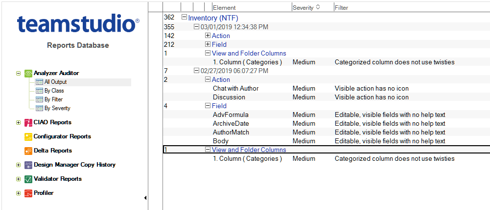

# 監査結果データベースの使用

データベースの監査結果は、**[Analyzer Auditor \ すべての出力文書 ]** ビューに表示されます。
<figure markdown="1">
  
</figure>

文書は、データベースタイトル別、実行の日時別、設計要素のカテゴリ別 に並べ替えられます。監査機能を同じデータベースに対して複数回実行す ると、結果はレポートが作成された日時別にグループ化されます。

!!! note
   監査結果データベースのナビゲータペインには、監査機能に適用されない ビューが表示されている場合があります。これは、データベースが Teamstudio の **tmslogs.ntf** テンプレートに基づいているためです。このテンプレートは、 弊社の全製品で使用できるように設計された汎用テンプレートです。監査機能 の文書を表示できるのは、[Analyzer Auditor ] ビューのみです。監査の目的 でデータベースを使用している場合は、その他のビューを無視してください。

監査機能は、監査実行で処理されるフィルタのいずれかに適合する設計オブジェクトを検出すると、そのたびに監査結果データベースに文書を作成 します。設計要素が適合するフィルタごとに文書が作成されるため、1 つの 設計要素が同じ設計カテゴリに 2 度以上現れる場合もあります。どの設計 要素がフィルタに適合したかを表示するには、設計要素カテゴリを展開してください。

<figure markdown="1">
  
</figure>
フィルタに適合した設計要素は、フィルタデータベースで定義された重大 度カテゴリに従って分類されます。この例では、複数の設計要素が低およ び中の重大度に割り当てられたフィルタに適合しています。

選択された項目が設計要素(フォームなど)である場合、設計要素の親項 目(データベースなど)が **[ 親要素 ]** の列に表示されます。選択された項目 が設計要素の構成要素(フォーム内のフィールドなど)である場合、その 親設計要素が **[ 親要素 ]** の列に表示されます。設計要素が適合したフィルタ は、[ フィルタ ] 列に表示されます。