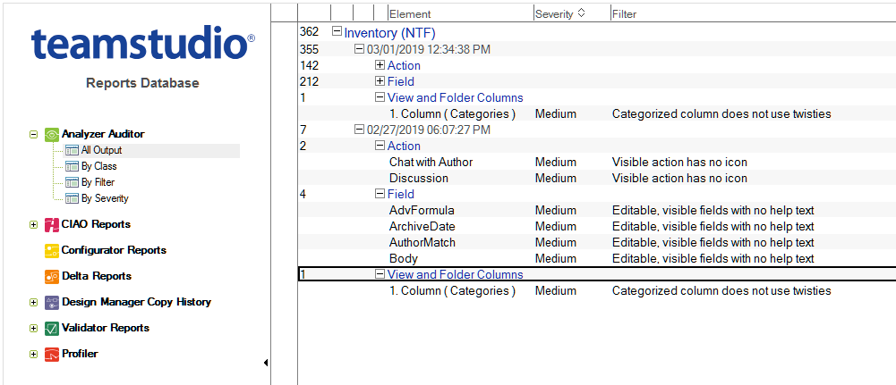
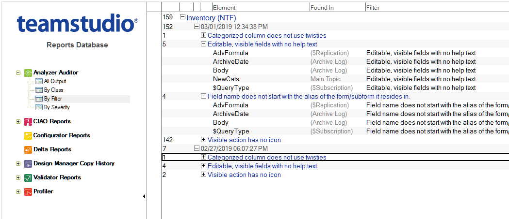

# Using the Audit Output Database

You can see the database audit results in the **Analyzer Auditor\All Output** view. 
<figure markdown="1">
  
</figure>

Documents are sorted by database title, the date and time Auditor was run and design element categories. Running Audit against the same database at different times gives you results grouped for each date and time reported. 

!!! note
    When you open the Audit output database, you may notice views in the navigator pane that do not apply to the Audit function. That is because the database is based on Teamstudio's **tmslogs.ntf** template, which is a general purpose template designed for use with all of our products. Since the Auditor only creates documents that appear in its own views, you may ignore the other views when using the database for auditing purposes.

Auditor creates a document in its output database each time it finds a design object that matches any of the filters processed during the audit run. A design element can appear more than once under its design category since a document is created for each filter a design element matches. Expand a design element category to learn which design elements matched the filters. 

<figure markdown="1">
  
</figure>
Design elements that matched a filter are divided into severity categories based on those defined in the Filters database. In this example, several design elements match filters assigned low and medium severity.

If the item selected is a design element (for example, a form), the parent of the design element (for example, the database) is listed in the **Found In** column. If the item selected is a component of a design element (for example, a field within a form), its host design element is shown under the **Found In** column. The filter the design element matched is listed in the **Filter** column.