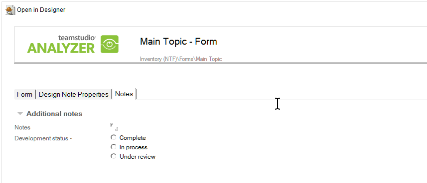

# Adding Comments to Design Elements

You can add user data, for example, comments, description, change history, or development status to the Analysis documents for major design elements. To view the comment area, click the **Notes** tab at the top of an analysis document.
<figure markdown="1">
  
</figure>
Double-click the document to make it editable and to display the development status options within the **Notes** area.

Items such as buttons and hotspots that Analyzer creates documents for do not have a corresponding design element in the application database. Consequently, they are difficult to identify reliably from one run to the next. Accordingly, the **Notes** field is not included on those documents. Field documents do contain the **Notes** field since they rarely change names and aliases.

You can create a separate document to record any additional information about a major design element document in the analysis database (for example, a description of a design element or maintenance history). You can access a sample document, named **Additional Documentation Sample**, from the **Create** menu. 

## To record additional information about a major design element
1. To create the document, select the design element you want, and select **Additional Documentation Sample** from the Create menu.  
   This sample form contains a title field (**fspvName_WB**) and a rich text body field in which to store your information. You can modify these fields to meet your organization's documentation requirements.  
   See [Customizing the Template](customizing.md), for more information.
2. Complete and save the form.  
   The saved document will display in the **AllDocuments** view under the design element you created it for.
 
!!! note
    The Additional Documentation feature is only available for design elements and fields.