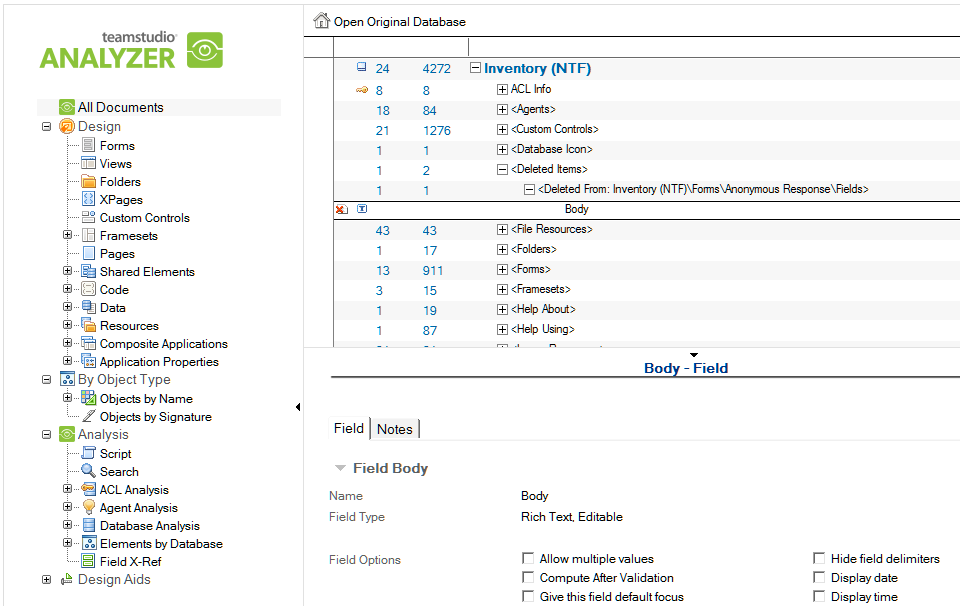

# Deleted Items

Analyzer moves the deleted element data and any user documentation for previously deleted design elements. You can find the data under the **Deleted Items** category, in the **All Documents** view.

You can identify the deleted element and any of its children documents, such as fields and buttons, by the Delete icon, a document with a red X through it.

<figure markdown="1">
  
</figure>

If you no longer need the deleted element data and its documentation, simply delete them from the Analysis file using the Delete hierarchy button.

!!! note
    You can drag deleted fields to the Field X-Ref folder to get a field cross reference report to
    show usage of the deleted field. See [References to a Field](references.md), for more information.