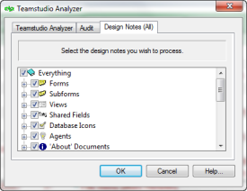

# 設計ノートタブの使用

[Design Notes] タブで、分析する個々の設計要素を選択することができます。
<figure markdown="1">
  
</figure>

デフォルトでは、すべてのカテゴリと設計要素が選択されています(チェッ クマークが付いています)。全カテゴリが [すべて] の子要素になっています。

カテゴリの設計要素を表示するには、カテゴリの横にあるプラス記号をク リックします。この操作は、現在選択されている、または選択解除されて いる項目には影響しません。

Analyzer では、選択されたカテゴリと、選択された設計要素は、次のよう に処理されます。

* 設計要素を選択した場合、Analyzer で分析され、結果データベースにその文書 が作成されます。設計要素が変更された場合、新しい文書によって既存の文書 が上書きされます。設計要素が変更されていない場合でも、[Teamstudio Analyzer] タブの **[増分アップデート]** チェックボックスがオフになっていると、 新しい文書によって既存の文書が上書きされます。
* カテゴリを選択した場合、Analyzer でカテゴリが確認されて、前回の分析以降 に検出された要素と文書が識別され、分析文書が結果データベース内の [ 削除 済み文書 ] カテゴリに移動します。