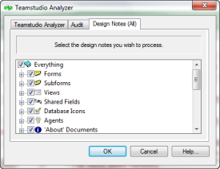

# Using the Design Notes Tab

You can select individual design elements for analysis from the Design Notes tab.
<figure markdown="1">
  
</figure>

By default, every category and design element is selected, as indicated by the checkmarks. All of the categories are children of **Everything**.

To see a category’s design elements without affecting currently selected or deselected items, click the plus sign beside the category.

Here is how Analyzer treats selected categories and selected design elements:

* If you select a design element, Analyzer analyzes it and creates a document for it in the output database. If the design element has changed, the new document overwrites the existing document. If the design element has not changed, the new document overwrites the existing document only if you have cleared the **Incremental update** check box on the Teamstudio Analyzer tab.
* If you select a category, Analyzer checks the category, identifies the elements and documents deleted since the last analysis, and moves the Analysis Document to the Deleted Documents category in the output database.