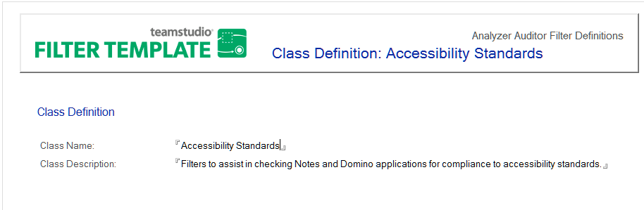

# クラスの編集と作成

監査機能のフィルタデータベースには、あらかじめ定義したフィルタのク ラスが含まれています。このデータベースでは、クラスの名前や解説を編 集したり、新たなクラスを作成したりできます。クラスを作成すると、そ のクラスにフィルタを追加することができます。フィルタは複数のクラス で使用することができます。

**[ 監査 ]** タブでフィルタセットを選択すると、Analyzer フィルタデータベー スのクラスがドロップダウンリストに表示されます。

## クラスを編集するには
1. Analyzer フィルタデータベースを開きます。
2. **[ 管理 ] > [ フィルタクラス ]** ビューをクリックします。
3. 既存のクラスをダブルクリックして、文書を開きます。
4. 文書をダブルクリックすると、編集モードになります。
5. 必要に応じて、クラス名やクラスの解説を変更します。
6. 文書を閉じるときは、プロンプトに従って変更を保存します。

## Toクラスを作成するには
1. Analyzer フィルタデータベースを開きます。
2. **[ 管理 ] > [ フィルタクラス ]** ビューをクリックします。
3. **[ 新規クラスの作成 ]**  ボタンをクリックします。
4. クラス名とクラスの解説を入力します。  
   クラス名は実行時に [ フィルタセットの選択 ] ボックスに表示されるため、簡 潔でわかりやすい名前を付ける必要があります。クラスの解説には、クラスで のフィルタの用途を入力します。  
   
 
5. 文書を閉じるときは、プロンプトに従って変更を保存します。