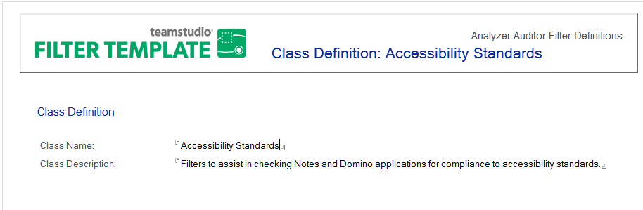

# Editing or Creating Classes

Auditor's Filter database includes pre-defined filter classes. You can edit the name or description of the class and you can create new classes. After you create a class, you can add filters to that class. A filter can belong to more than one class.

When you choose a Filter Set on Analyzer's **Audit** tab, the classes from the Analyzer Filter database display in the drop-down list.

## To Edit a Class
1. Open the Analyzer Filter database.
2. Click the **Admin > Filter Classes** view.
3. Double-click an existing Class to open the document.
4. Double-click the document to enter edit mode.
5. Change the **Class Name** or **Class Description** to meet your requirements.
6. Save your changes as prompted when you close the document.

## To create a class
1. Open the Analyzer Filter database.
2. Click the **Admin > Filter Classes** view.
3. Click the **Create Class** button.
4. Enter the **Class Name** and **Class Description**.  
   The **Class Name** should be something brief but descriptive since it will be shown in the Filter Set selection box at run-time. The **Class Definition** should explain the use of the filters in the Class.  
   
 
5. Save your changes as prompted when you close the document.