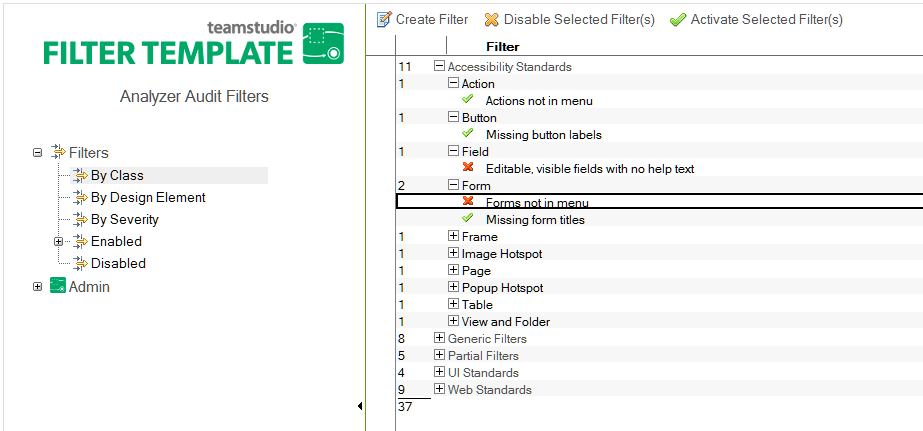

# フィルタを無効／有効にする

あるフィルタの使用を停止したり、選択して使用することができます。

フィルタを無効にすると、そのフィルタが属しているクラスを選択しても フィルタは評価されません。

無効にしたフィルタは、後で再び有効にすることもできます。

## フィルタを無効または有効にするには
1. Analyzer フィルタデータベースから、フィルタビュー(**[ クラス別 ]** や **[ 設計要 素別 ]** など)をクリックします。
2. 左の列をクリックして、無効にするフィルタを選択します(複数選択可)。
3. **[ 選択フィルタを無効にする ]** または **[ 選択フィルタを有効にする ]** をクリック します。

<figure markdown="1">
  
</figure>
緑のチェックマークは、フィルタが有効になっていることを示します。赤の X は、フィルタが無効になっていることを示します。 無効にしたフィルタは、必要に応じて有効にしてください。