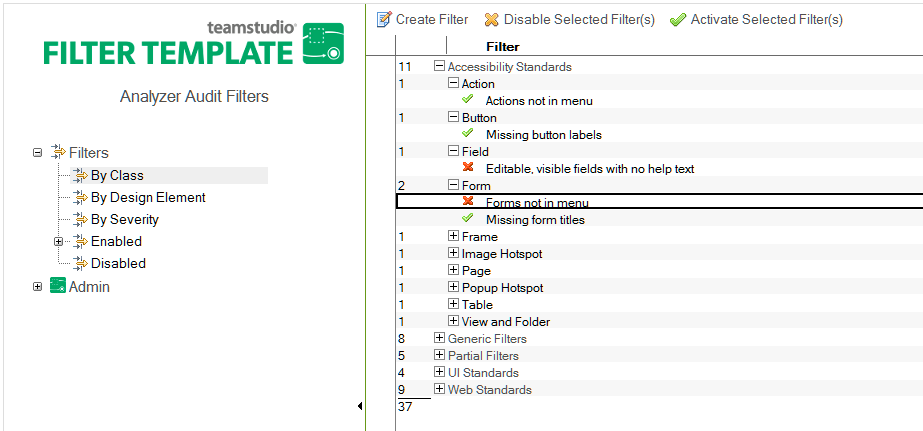

# Disabling or Activating Filters

You may decide to stop using a filter, or to use it selectively.

When you disable a filter, Analyzer won't evaluate the filter when you pick a class that the filter belongs to.

You can reactivate a filter later.

## To disable or activate a filter
1. From the Analyzer Filter database, click a Filter view, for example, **By Class**, or **By Design Element**.
2. Click in the left column to select one or more filters to disable.
3. Click **Disable Selected Filter(s)** or **Activate Selected Filter(s)**.

<figure markdown="1">
  
</figure>
A green check mark indicates that the filter is active. A red X indicates that the filter is disabled.

Remember to activate disabled filters when required. 