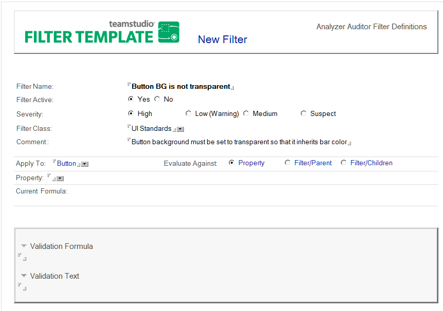
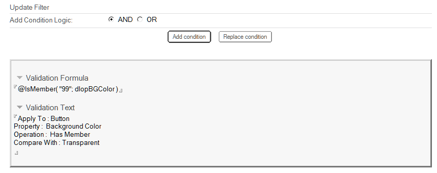
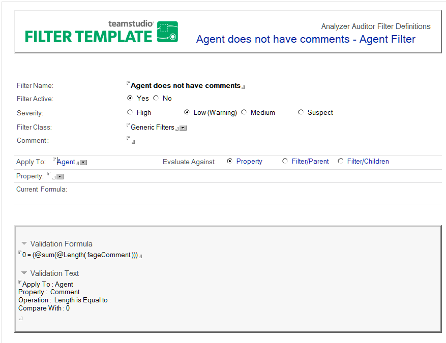

# フィルタの編集と作成

既存フィルタの定義を変更したり、新たにフィルタを作成したりできます。

## フィルタを作成するには
1. フィルタデータベース(deanfltr.nsf)を開きます。
2. **[ 新規フィルタの作成 ]** アクションボタンをクリックします。  
   新たなフィルタの文書が表示されます。  
   
3. 次のフィールドに入力して、新規フィルタを定義します。  
   
<table><tr><th>フィールド></th><th>説明</th></tr>
     <tr><td>フィルタ名</td><td>フィルタの目的(Java コードを使用するエージェントなど)。</td></tr>
     <tr><td>フィルタを有効にする</td><td>所属するクラスの処理が選択されたときにこのフィルタを含めるかどうかを、<b>[ はい ]</b> または <b>[ いいえ ]</b> で設定します。</td></tr>
     <tr><td>重大度</td><td>この基準に適合する項目の相対的な重要度。</td></tr>
     <tr><td>フィルタクラス</td><td>フィルタが属する 1 つ以上のグループ(クラス)</td></tr>
     <tr><td>コメント</td><td>フィルタを使用する理由(リリース A から B へのアップグレー ドなど)。</td></tr>
     <tr><td>適用設計要素</td><td><b>[ 適用設計要素 ]</b> ドロップダウンリストをクリックして、フィル タを確認する設計要素を選択します。これがテストの主な対象になります。 
  <b>[ すべて ]</b> を選択すると、データベース設計内のすべての要素に 適用されるフィルタを作成することができるのに対し、<b>[ 全設計 要素 ]</b> を選択すると、ページ、フォーム、ビューなど最初のレベ ルの要素にフィルタの適用が制限されます。フィールド、ホット スポット、列などのサブエレメントは無視されます(監査対象に 含まれません)。 <b>[ 適用設計要素 ]</b> フィールドを選択すると、フォームが展開され、 <b>[ 査定対象 ]</b> オプション、<b>[ プロパティ ]</b> フィールド、およびその 他のフィルタオプションが表示されます。</td></tr>
     <tr><td>査定対象</td><td>検証式にプロパティを含めるプロパティオプションを選択する か、既存のフィルタを [ 適用設計要素 ] フィールドの要素の親ま たは子に適用するオプションを選択します。</td></tr>
     <tr><td>プロパティ</td><td>テストするプロパティを選択します。この一覧は、<b>[ 適用設計要素 ]</b> フィールドのタイプに基づいて生成されます。 プロパティを選択すると、選択手順で使用する条件を定義するオ プションが表示されます。表示される条件オプションは、<b>[ 適用設計要素 ]</b> および <b>[ プロパティ ]</b> フィールドでの選択内容に基づ いています。</td></tr>
     <tr><td>条件></td><td>テストを定義する適切なオペレーションを選択します。オペレー ションの選択内容は、すでに <b>[ 適用設定要素 ]</b> および <b>[ プロパ ティ ]</b> で選択した内容によって異なります。 たとえば、<b>[ 適用設計要素 ]</b> に <b>[ ボタン ]</b> を選択し、<b>[ プロパティ ]</b> に <b>[ 非表示オプション ]</b> を選択します。条件は、<b>[ 次のどれかを含む ]</b> などのオペレーションを 1 つ選択するだけで追加できま す。次に、<b>[Web ブラウザ ]</b> などの値を選択します。複数の条件 をテストするには、<b>[AND]</b> または <b>[OR]</b> をクリックして、論理演 算子を指定します。 単一条件の要素を選択した場合は、<b>[ 条件を追加 ]</b> ボタンをクリッ クして検証式を更新し、定義したテストを検証式に含めます。</td></tr>
     </table>
     次の表はフィルターフォーム上のボタン群に関する説明です
     <table><tr><th>ボタン</th><th>説明</th></tr>
       <tr><td>条件を追加</td><td>定義したテストを含む検証式を追加します。ひとつ以上の式が指定する場合、条件論理を追加ボタンで組み合わせの条件を使用し真偽を決定します: 
 – AND: すべての条件がフィルターに一致する「真」の値でなければなりません。
 – OR: いづれかの条件が一致する場合</td></tr>
       <tr><td>条件と置換</td><td>検証式全体を削除します。このボタンと使用してフィルター全体を再定義することができ、適用設計要素で指定している同一の設計要素から開始できます。</td></tr>
     </table>

4. 必要に応じて条件の追加と条件の置換で条件を作成します。条件式は検証式フィールドに書き込まれ、条件の説明が検証テキストフィールドに追加されます。
   

文書を閉じ、変更を保存してください。

## フィルタを編集するには
1. Analyzer フィルタデータベースを開きます。
2. 既存のフィルタをダブルクリックして、文書を開きます。
3. 文書をダブルクリックすると、編集モードになります。  
   
4. 目的のフィールドを編集します。 編集で新たな検証式が必要な場合は、プロパティを選択して条件を追加または 置換したときに自動的に生成されます。
5. Use検証式がどのように作成されたかをリバースエンジニアリングするには、**[検証 テキスト ]** を確認します。 
6. 文書を閉じるときは、プロンプトに従って変更を保存します。

!!! note
    異なる設計要素に適用するフィルタを作成するには、完全に新し いフィルタを作成する必要があります。検証式を変更するには、 **[ 条件を追加 ]** または **[ 条件を置換 ]** 機能を使用して、式を再構築 します。   