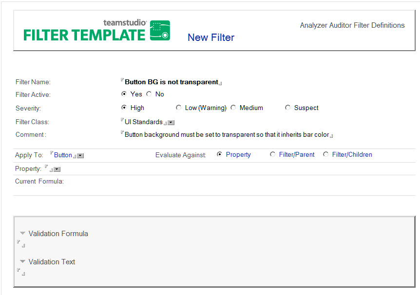
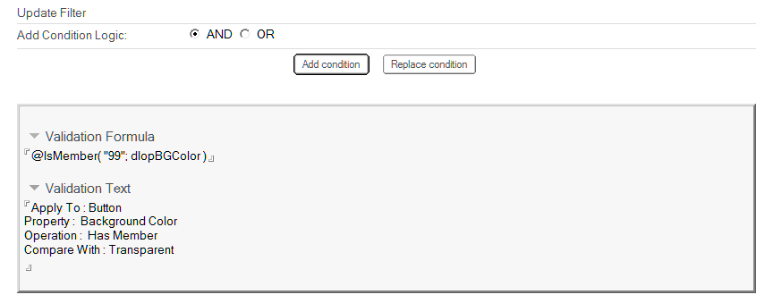
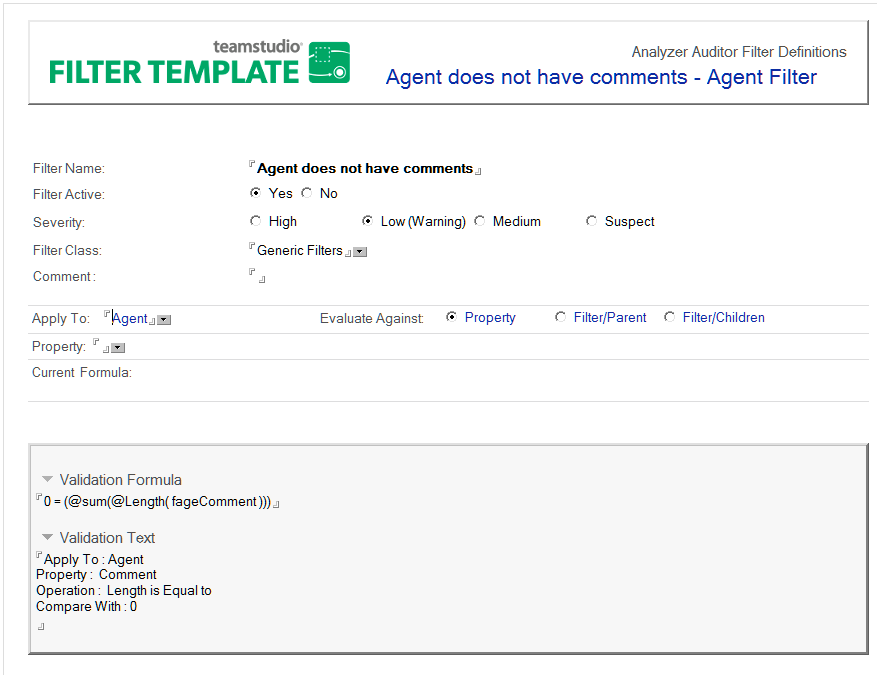

# Editing or Creating Filters

You can change the specifications of an existing filter or create a new filter.

## To create a filter
1. Open the Filter database (deanfltr.nsf).
2. Click the **Create Filter** action button.  
   You see a New Filter document:  
   
3. Define the new filter by creating the following fields:
   
<table><tr><th>Field></th><th>Description</th></tr>
     <tr><td>Filter Name</td><td>The purpose of the filter, for example, agents using Java code.</td></tr>
     <tr><td>Filter Active></td><td><strong>Yes/No</strong> indicates whether the filter should be included when one of its classes is chosen for processing.</td></tr>
     <tr><td>Severity</td><td>The relative importance of items matching this filter.</td></tr>
     <tr><td>Filter Class</td><td>One or more groups (classes) to which the filter belongs.</td></tr>
     <tr><td>Comment</td><td>The reason to use the filter, for example, Release A to Release B upgrade.</td></tr>
     <tr><td>Apply To</td><td>Click the Apply To dropdown to select the design element you want the filter to check. This is the primary focus of the test. 
  While selecting <strong>All</strong> lets you create filters that apply to all elements within a database design, selecting <strong>All Design Elements</strong> restricts your filter to first-level elements such as page, form or view. It ignores (doesn't include as audit targets) sub-elements such as field, hotspot, and column. 
With the <strong>Apply To</strong> field chosen, the form expands to show the <strong>Evaluate Against</strong> options, the <strong>Property</strong> field, and other filter options.</td></tr>
     <tr><td>Evaluate Against</td><td>Select the Property option to include a property in the validation formula, or select an option to apply an existing filter against the Parent or the Children of the element in the Apply To field.</td></tr>
     <tr><td>Property</td><td>Select the property you want to test. The list generated is based on the <strong>Apply To</strong> field type. Once you select the property, the form shows options for defining a condition to use in the selection step. The condition options you see are based on the <strong>Apply To</strong> and <strong>Property</strong> fields selected.</td></tr>
     <tr><td>Condition></td><td>Select the appropriate operation to define your test. The operation choices depend on the <strong>Apply To</strong> and <strong>Property</strong> selections you made previously. For example, select <strong>Button</strong> for the <strong>Apply To</strong> design element and <strong>Hide When Options</strong> for the property. To add a Condition, simply select one of the operations such as <strong>Has one of the following</strong>. Then select a <strong>Compare With</strong> value such as <strong>Web browsers</strong>. To test multiple conditions, you click <strong>AND</strong> or <strong>OR</strong> to specify the logical operator. When you have selected the elements of a single condition, click the <strong>Add Condition</strong> button to have the <strong>Validation Formula</strong> updated to include the test just completed.</td></tr>
     </table>
     The following table describes the buttons on the **Filter** form:
     <table><tr><th>Button</th><th>Description</th></tr>
       <tr><td>Add Condition</td><td>Appends the <strong>Validation Formula</strong> to include the test just defined. When more than one formula is specified, the Add Condition Logic radio button determines the boolean operator used to combine conditions: – AND: all conditions must be true for the filter to match. – OR: any condition causes a match.</td></tr>
       <tr><td>Replace Condition</td><td>Deletes the entire <strong>Validation Formula</strong>. Use this button to effectively redefine the entire filter, starting with the same design element in the <strong>Apply To</strong> field.</td></tr>
     </table>

4. Add or Replace the condition as desired.  The new condition formula is written to the Validation Formula field, and a description of the condition is added to the Validation Text field:  
   

Save your changes as prompted when you close the document.

## To edit a filter
1. Open the Analyzer Filter database.
2. Double-click an existing filter to open the document.
3. Double-click the document to enter edit mode.  
   
4. Edit the fields you want. If your edits require a new validation formula, Auditor automatically generates it when you select a property and add or replace a condition.
5. Use the **Validation Text** field to *reverse engineer* how a validation formula was created. 
6. Save your changes as prompted when you close the document.

!!! note
    To develop a filter for a different design element, you must create an entirely new filter. To modify the **Validation Formula**, use the **Add or Replace Condition** functions to rebuild the formula.   