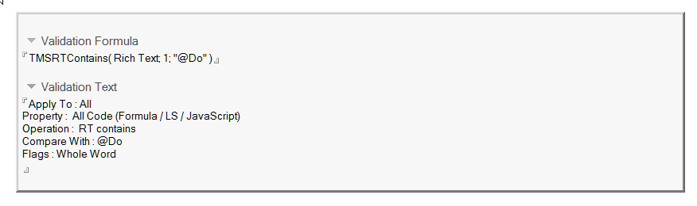

# Filter Example

The following table shows examples of filters you can create. Procedures for creating them follow the table.

<table>
<tr><th>Filter Example</th><th>Description</th></tr>
<tr><td>Search for static text</td>
<td>You can search your database for instances of a particular @Function such as <strong>@Do</strong>. To do this, create a filter that searches for <strong>@Do</strong> using the <strong>TMSRTContains</strong> formula. Use whole word matching, or the search result will include other functions that begin with <strong>@Do</strong>, such as <strong>@Doc</strong>, <strong>@DoChildren</strong>, and <strong>@DocFields</strong>.</td></tr>
<tr><td>Search for values included within an analysis document</td>
<td>To meet corporate standards, you must find and correct all the forms that do not include their name in the window title. To do this, you would likely pass the form name to the <strong>TMSRTContains</strong> function using a formula such as <strong>TMSRTContains( ffrmWinTitle; 0; "Memo")</strong>, where "Memo" is a particular form's name. However, you want to find all such forms, not just "Memo." 
To search for all such forms, pass the field name that contains the title of the form instead of a literal string of the form name. You can then apply this filter to all forms, not just a particular form.</td></tr>
<tr><td>Use values from the parent</td><td>One of your company's standards is that field names must start with form aliases. You can create a filter that shows all the fields in a document, where field names do not start with the alias of the form/subform they reside in.</td></tr>
</table>

## Create a filter that searches for "@Do"
1. Open the Auditor Filter database, which is called **deanfltr.nsf**.
2. Click **Create Filter** to open the **New Filter** window.
3. From the **New Filter** window, enter the following
   
<table><tr><th>Field name</th><th>What to enter or select</th></tr>
    <tr><td>Filter name:</td><td>Use of <strong>@Do</strong> in database</td></tr>
    <tr><td>Filter Active:</td><td>Yes</td></tr>
    <tr><td>Severity:</td><td>Medium</td></tr>
    <tr><td>Filter Class:</td><td>Generic Filters</td></tr>
    <tr><td>Comment:</td><td>Look for the use of <strong>@Do</strong></td></tr>
    <tr><td>Apply To:</td><td>All</td></tr>
   </table>
   The new filter should now look like this:
   

4. In the **Property** field, click the arrow to display the list. Then select the keyword **All Code (Formula / LS / JavaScript)**.
5. In the **Operation** field, select the **RT contains** option.
6. In the **Compare To** field, enter **@DO**.
7. In the **Flag** field, click the arrow to display the list.
8. Select **Whole Word** and click **OK**.
9. Click **Add Condition**.  
   The new condition is added to the formula in the **Validation Formula** field:  
   
 
10. Save the filter and exit.