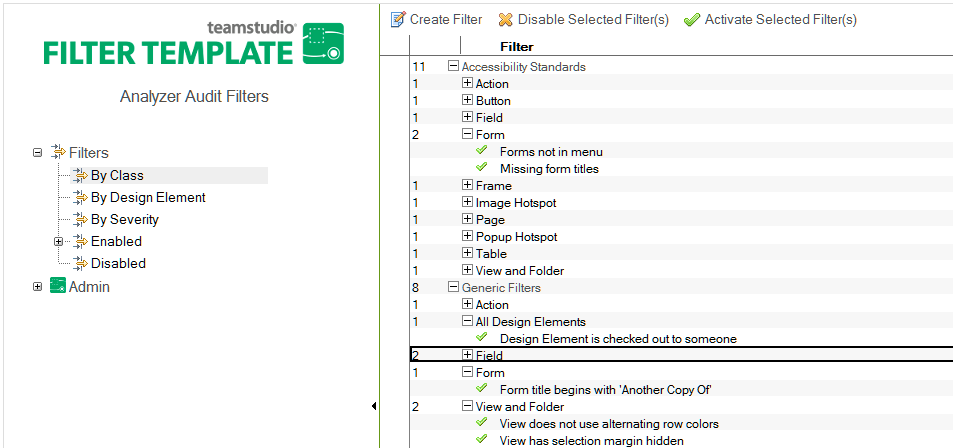

# Reviewing Filters

When you open the Analyzer Filter database, you can review the following:

* Filter Classes—name and description
* The Filters themselves
    * by the Class they are assigned to
    * by the Design Element they audit
* The Severity Definitions—name and description

<figure markdown="1">
  
</figure>