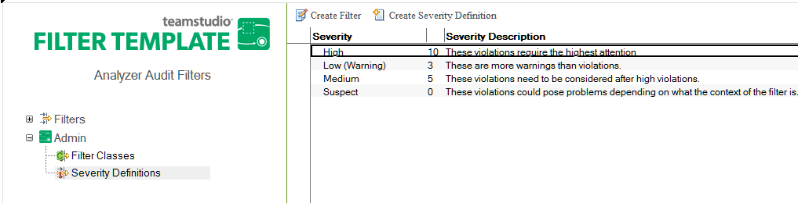
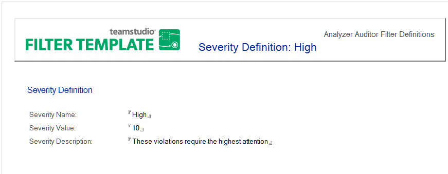

# 重大度定義の編集と作成

監査データベースでは、各フィルタに割り当てられる重大度レベルがあら かじめ定義されています。監査機能では、データが重大度に基づいて降順 で表示されます。数値が大きくなるほど、選択されたデータ要素に発生し ている問題の重要度も大きくなります。この重大度レベルには、マイナス の値も含む任意の数字を割り当てることができます。

<figure markdown="1">
  
</figure>

次の例は、フィルタの重大度コードをどのように設定できるかを示してい ます。たとえば、既存の重大度レベルの名前や解説を独自の基準に合わせ て変更したり、まったく新しい重大度レベルを作成したりすることができ ます。

## 重大度レベルを編集するには
1. Analyzer フィルタデータベースを開きます。
2. **[ 管理 ] > [ 重大度定義 ]** ビューをクリックします。
3. 既存の重大度定義をダブルクリックして、文書を開きます。
4. 文書をダブルクリックすると、編集モードになります。
5. 必要に応じて、重大度の名前、値、または解説を変更します。
6. 文書を閉じるときは、プロンプトに従って変更を保存します。

## 重大度レベルを作成するには
1. Analyzer フィルタデータベースを開きます。
2. **[ 重大度定義 ]** ビューをクリックします。
3. **[ 重大度定義の作成 ]** をクリックします。
4. 重大度の名前、値、および解説を入力します。  
     
  重大度の値が大きくなるほど、フィルタにより識別されたデータ要素を修正す る重要度も大きくなります。重大度レベルには任意の数字を割り当てることが できます。
5. 文書を閉じるときは、プロンプトに従って変更を保存します。