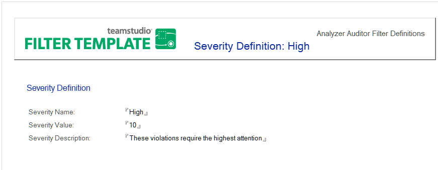

# Editing or Creating Severity Definitions

The Audit database includes pre-defined severity levels that are assigned to each filter. Auditor displays data in descending sort order for severity sequence. The higher the numeric value, the more important it is to address the issue causing the data element's selection. You can assign severity levels in any numerical range, including negative numbers. 

<figure markdown="1">
  
</figure>

The following example shows how you can set up severity codes for filters. You can change the name or description of an existing severity level to meet your standards, or create an entirely new severity level.

## To edit a severity level
1. Open the Analyzer Filter database.
2. Click the **Admin > Severity Definitions** view.
3. Double-click an existing Severity Definition to open the document.
4. Double-click the document to enter edit mode.
5. Change the **Severity Name**, **Value** or **Description** to meet your requirements.
6. Save your changes as prompted when you close the document.

## To create a severity level
1. Open the Analyzer Filter database.
2. Click the **Severity Definitions** view.
3. Click **Create Severity Definition**.
4. Enter the **Severity Name**, **Value** and **Description**.  
     
  The higher the severity value, the more important it is to fix the data element identified by the filter. You may assign severity levels in any numerical range.
5. Save your changes as prompted when you close the document.