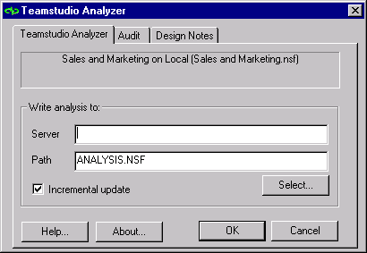

# Controlling Incremental Updates

The first time you run Analyzer against a database, every design element is analyzed (unless you excluded some of them on the **Design Notes** tab). When you run Analyzer subsequent times, select the **Incremental update** check box to analyze and update the documents for only those design elements that have changed since Analyzer was last run against them.
<figure markdown="1">
  
</figure>
Clear the **Incremental update** check box to analyze every design element and update every document even if it has not changed. This feature allows you to change the title of a database and then update the design documentation and propagate the new title into other design elements.