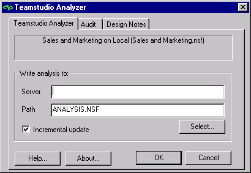

# Starting Analyzer

To start Analyzer 

1. In Designer, open the database you want to analyze.
2. Click the Analyzer button on the toolbar.  
   You see the Teamstudio Analyzer window.  
   
 
3. On the Teamstudio Analyzer tab, enter the server name and file name of the analysis output database that will store the analysis of your database design. If the output database doesn't exist, you will be prompted to create it when Analyzer runs.  
   When you click OK, Analyzer examines all design elements and stores the results in the database you have specified.  
   You can use the Design Notes tab to tell Analyzer which design elements you want to analyze. See [Using the Design Notes Tab](designtab.md).
4. On the Audit tab, enable Auditor which tests your design elements against a pre-defined set of filters. See [Auditing a Design](auditing.md).

Typically, there is one analysis output database and one audit output database for each project. There may be a number of different database designs represented in each output database.You may organize the output databases differently. 

!!! note
    Design analysis databases become huge if they contain information about several database designs. If you select a large number of design elements for review by an audit run, the audit output database can also become quite large. Consider using more than one output database for analysis and/or audit runs, and decide in advance how to split design information among different output databases.