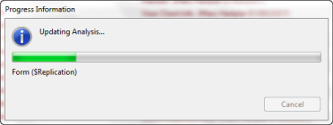

# 分析の開始

1. Analyzer が使用する結果データベースの指定、分析する設計要素の指定(任意)、 および監査機能の設定(任意)が終了したら、**[OK]** をクリックして分析を開始します。  
   データベース設計分析は監査の前に行われます。  
   Teamstudio Analyzer のインジケータには、処理中の各設計要素の名前が表示されます。  
     
   分析が完了すると、指定した分析結果データベースが開きます。
2. カテゴリ内の設計要素に関する分析文書を表示するにはカテゴリを展開します。

!!! note
    監査機能を実行した場合は、監査結果データベースを開く必要があります。
