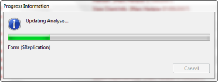

# Starting the Analysis

1. After you specify the output database that Analyzer should use, optionally include or exclude design elements to analyze and optionally set up Auditor, click **OK** to start the analysis process.  
   The database design analysis runs before the audit is performed.  
   You see the Teamstudio Analyzer progress indicator that displays the name of each element as it is processed.  
     
   When the analysis is complete, Analyzer opens the analysis output database you designated.
2. Expand categories to reveal Analyzer's design element analysis documents within the categories.

!!! note
    If you ran an audit, you will find the results in the audit output database rather than the analysis output database.
