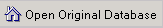
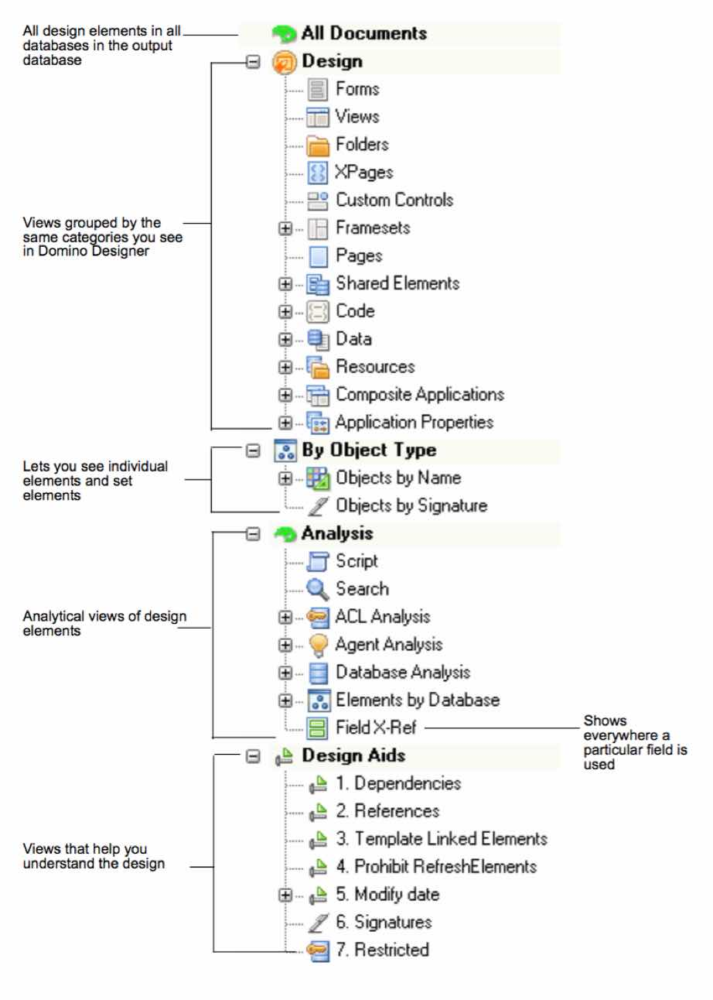

# ビューのサマリ

結果データベースのテンプレートには、次のビューのグループが含まれて います。

| ビュー | 説明 |
| --- | --- |
| すべての文書 | 
結果データベースに示されているすべてのデータベースの全設計要 素を表示します。ビューはデータベースタイトル順に並べ替えられ ます。また、ビューの階層構造はデータベース設計の階層構造を表 しています。

アクティビティウィンドウの最初の列は、各カテゴリ内のオブジェ クトの件数を表しています。

ボタンをクリックすると、ノーツの新しいウィ ンドウに分析を実行したデータベースを開くことができます。

| 設計 | Domino Designer に表示される同じカテゴリごとにグループ化された ビューが表示されます。 |
| オブジェクトタイプ別 | 特定のフィールドが使用される場所を表示する[ フィールドの相互参照] ビューも含まれます。 |
| 分析 | 設計要素の分析ビュー。 |
| 設計補助 | 設計を把握するためのビュー。 |

## The Analysis Output Database Views
<figure markdown="1">
  
</figure>