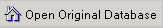
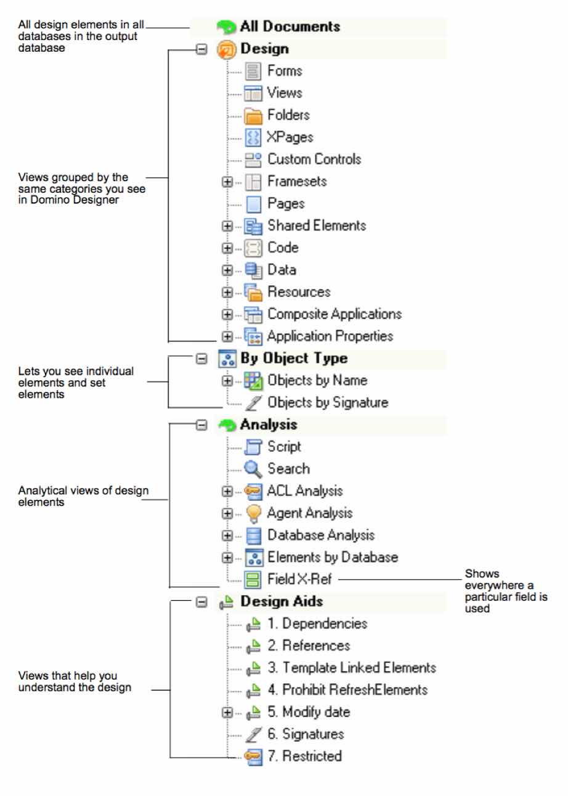

# Summary of Views

The output database template includes the following groups of views:

| View | Description |
| --- | --- |
| All documents | 
Shows all design elements in all databases in the output database. The view is sorted by database title. The hierarchy represents the hierarchy of the database design.

The first column in the activity window shows the number (count) of objects within each category.

Click the   button to open the database, from which the analysis was taken, in a new Notes window.

| Design | Shows views grouped by the same categories you see in Domino Designer. |
| By Object Type | Also includes the Field X-Ref view that shows where a particular field is used. |
| Analysis | Analytical views of design elements. |
| Design Aids | Views that help you understand the design. |

## The Analysis Output Database Views
<figure markdown="1">
  
</figure>