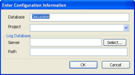

# データベースを CIAO! の監視下に置くには
データベースを CIAO! の監視下に置くと、CIAO! はデータベースの監視や、変更の追跡とレポートを行ったり、要素のチェックインとチェックアウトを許可して、複数のユーザーが同じ要素を同時に変更することがないようにすることができます。

次の手順でデータベースを CIAO! の監視下に置くことができます。

1. Designer で、作業するデータベースを開きます。
2. ツールバーの[CIAO!]ボタンをクリックします。  
   そのデータベースを監視するように CIAO! が設定されていないことを示し、監視下のデータベースのリストに一覧に追加するかどうかを確認するメッセージが表示されます。
3. **[ はい ]** をクリックします。  
   **[ 設定情報の入力 ]** ウィンドウが表示されます。  
   
4. 設定情報を入力し、**[OK]**をクリックします。次の表では、設定フィールドについて説明します。
   <table><tr><th>フィールド</th><th>説明</th></tr>
     <tr><td>データベース</td><td>監視するデータベースのタイトル。デフォルト情報は、ワークスペースで選択したデータベースアイコンに基づいています。</td></tr>
     <tr><td>プロジェクト</td><td>作業をプロジェクトとして設定できます。各プロジェクトにはいくつかのデータベースが含まれます。以前にプロジェクトを定義している場合は、このフィールドのドロップダウンメニューにそのプロジェクト名が表示されます。このフィールドにプロジェクト名を入力して、新しいプロジェクトを作成することもできます。</td></tr>
     <tr><td>ログデータベース</td><td>サーバーとログデータベースのパスを入力するか、[選択]をクリックして既存のログデータベースを参照します。指定したサーバーとパスに対応するログデータベースがない場合は、新しいログデータベースが作成されます。</td></tr>
   </table>
5. **[ バージョンコメントの入力 ]** ウィンドウが表示されます。  
     
   コメント(たとえば、「これはCIAO!の監視下にある初回バージョンです」など)を入力し、[OK] をクリックします。  
     
   

     
Note

     
<b>[ キャンセル ]</b> をクリックすると、データベースは、ベースラインバージョンなしで CAIO! の監視下に置かれます。データベースが CIAO! 監視下に置かれなくなるわけではなりません。

   

6. [ バージョンラベル ] フィールドに初回バージョン(または 01.00.00 などの任意の名前)を入力し(デフォルトは「BASELINE」です)、[OK] をクリックします。フィールド設定に関する詳細は、[バージョンオプションについて](versionoptions.md) を参照してください。