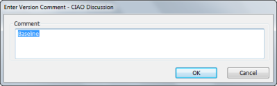

# To put a database under CIAO! control

You put a database under CIAO! control so CIAO! can watch the database, keep track of and report on changes, and allow check-in and check-out of elements to keep multiple users from modifying the same elements at the same time.

You can put a database under CIAO! control as follows:

1. In Designer, open the database you want to work with.
2. Click the CIAO! button on the toolbar.  
   You see a message telling you that CIAO! is not configured to watch that database and asking if you want to add it to the list of watched databases.
3. Click **Yes**.  
   You see the Enter Configuration Information window.  
   
4. Enter the configuration information and click OK. The following table describes the configuration fields.  
   <table><tr><th>Field></th><th>Description></th></tr>
     <tr><td>Database</td><td>The title of the database to watch. The default information is based on the database icon you selected on the workspace.</td></tr>
     <tr><td>Project</td><td>You can organize your work into projects. Each project has a set of databases within it. If you have previously defined any projects, they appear in the drop-down menu in this field. You can create a new project by typing the project name into this field.</td></tr>
     <tr><td>Log Database</td><td>You enter the server and path for the log database or click Select to browse for an existing log database. CIAO! creates a new Log database, if one does not exist for the specified server and path.</td></tr>
   </table>
5. You see the **Enter Version Comment** window.  
     
   Enter a comment, for example, "This is the initial version under CIAO! control" and click **OK**. You see the **Version Options** window.  
     
   

     
Note

     
Clicking Cancel puts the database under CAIO! control without a baseline version. It does not cancel putting the database under CIAO! control.

   

6. Enter **Initial** (or a name of your choice, such as 01.00.00) into the **Version Label** field (the default is BASELINE) and click **OK**.  
   See [Understanding Version Options](versionoptions.md), for more information on field settings.