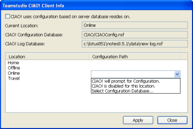

# CIAO! をセットアップする別の方法
CIAO! は、それぞれのロケーションが別の設定データベースを指すようにセットアップできます。これは、さまざまな場所を動き回るユーザーにとって便利です。

## CIAO! 設定データベースへのパスを見つけたり、変更したりするには
次の手順で、CIAO! 設定データベースへのパスを変更できます。

1. **[CIAO! ビュー ]** メニューから、**[ クライアント情報 ]** を選択します。  
     
   [Teamstudio CIAO! クライアント情報 ] ウィンドウが表示されます。  
   
 
2. ロケーションごとに、[設定ファイルパス]ドロップダウンから選択します。

!!! Note
    CIAO! は、テンプレート CIAOConfig に基づくデータベースだけを表示します。ウィンドウに表示されていない設定データベースがある場合は、その設計の基となっているテンプレートの名前が **CIAOConfig** であることを確認してください。  
  	CIAO! Server Edition を使用して、データベースを監視する場合は、CIAO! Server Edition と同じ設定データベースを選択するよう強くお勧めします。これにより、監視下に置くすべてのデータベースをサーバーによって制御することもできます。 不明な点については、CIAO! 管理者にお問い合わせください。
