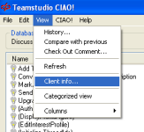
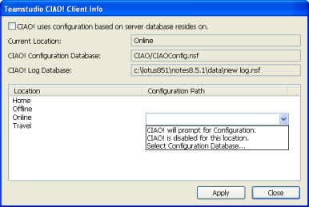

# Alternate Ways to Set up CIAO!

CIAO! can be set up so that each location can point to a different configuration database. This is convenient for those who are on-the-go.

## To locate and/or change the path to your CIAO! Config database
You can change the path to your CIAO! Config database as follows:

1. From the CIAO! **View** menu, click **Client Info**.  
     
   You see the Teamstudio CIAO! Client Info window.  
   
 
2. For each location, select from the Configuration Path dropdown.

!!! Note
    CIAO! displays only those databases based on the template CIAOConfig. If you know you have a configuration database that does not show up in the window, check to make sure that the name of the template on which the design is based is **CIAOConfig**.  
  	If your organization is using CIAO! Server Edition to monitor databases, we strongly recommend that you select the same configuration database that the copy of CIAO! Server Edition is using. This ensures that any databases that you put under control will also be controlled by the server. If in doubt, please check with your CIAO! administrator.
