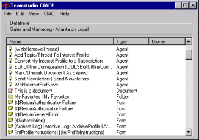

# CIAO! 文書の監視の設定

CIAO! を使用して文書を監視できます。文書の監視はデータベースごとに設定します。監視する文書の例としては、設定情報や Web サイトのコンテンツが含まれる文書などがあります。通常は、プロダクション(本番稼動) 環境のアプリケーションの文書は監視しません。

## 文書の監視を有効にするには
1. CIAO! 設定データベースを開き、目的のデータベースのエントリを検索します。
2. データベースの設定データベースエントリを開きます。
3. **[ 監視 ]** タブをクリックします。
4. **[ 文書を監視 ]** オプションを **[ はい ]** に設定します。  
   [$TMSTitle] フィールドを含む文書が CIAO! の監視下に置かれます。このフィールドはテキストタイプで、フィールドにはこの文書の参照に使用するテキストを含めます。CIAO! のユーザーインターフェイスでは、これらの文書は文書タイプで、タイトルは [$TMSTitle] の値です。  
   その後、通常どおり文書をチェックインおよびチェックアウトできます。
   
!!! note
    To文書の監視を中止する場合は、文書をチェックアウトして、その [$TMSTitle] フィールドを削除します。
    
次の例では、[$TMSTitle] フィールドがデータベースの単一文書に追加され、*「これは文書です」*という値に設定されています。
<figure markdown="1">
  
</figure>
 