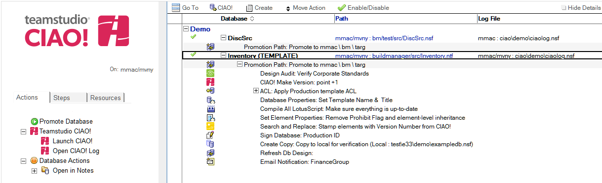
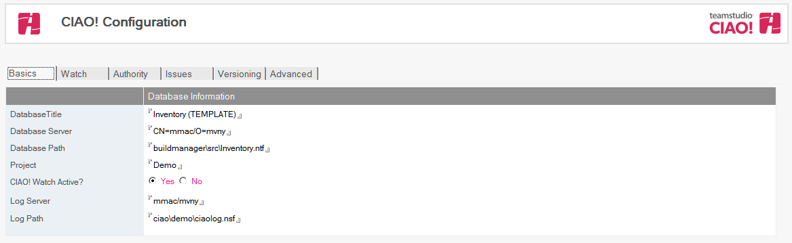

# CIAO! によるデータベースコントロールの有効化と無効化
CIAO! コントロールからデータベースを削除するには、CIAO! 設定データベースで監視下のデータベースの文書を編集します。

## 監視下に置かれているデータベースの文書を編集するには
1. CIAO! 設定データベースを開きます(通常は、サーバー上)。
2. **[ ジャンプ ]** セクションで、**[ プロモーションパス ]** ビューのいずれか([ パス別データベース ] など)をクリックします。  
   
   

     
Note

     
上の図で、緑のチェックマークはデータベースが CIAO! の監視下にあることを示します。そのデータベースを CIAO! の監視下から外すと、アイコンは赤の X に変わります。

   

3. CIAO! の監視下から外すデータベースの文書を選択し、その文書を開いて編集します。
4. **[ アクティブ ]** フィールドの値を **[ はい ]** から **[ いいえ ]** に変更して、データベー スを CIAO! の監視下から外します。  
   
 
!!! note
    データベースを監視下から外すと、そのデータベースではチェックイン/ チェックアウト機能は使用できません。すべての開発者は、そのデータベースのどの設計要素でも変更できるようになります。  
    この処理により、データベースの履歴が削除されることはありません。履歴は CIAO! ログデータベースに維持されます。また履歴データについても、ログデータベースから削除しない限り、アクセスすることができます。
