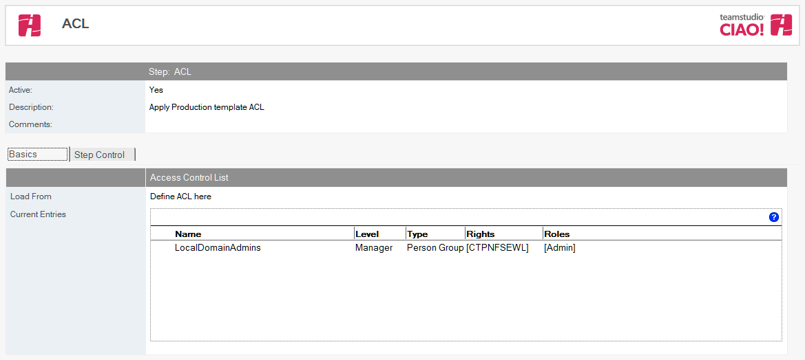
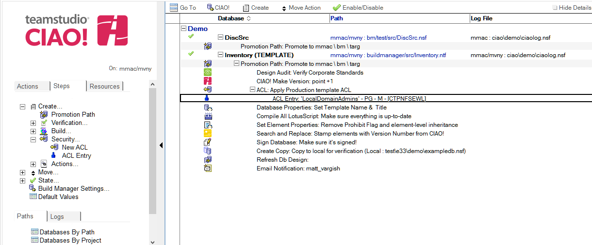

# ACL と ACL エントリ

## ACLの設定
Teamstudio CIAO! を使用して昇格されるファイルの ACL を設定します。  
**Note:** ACLは昇格されるファイル（通常テンプレート）に設定されます。このテンプレートにリンクされているいずれのデータベースのACLにも影響は及ぼしません。

### データベースもしくはテンプレートのACL を設定するには:
1. 特定の ACL を設定するデータベースまたはテンプレートに関するビルドもしくはプロモーションパスを選択します。
2. **[作成]**アクションボタンをクリックし、[ACL]を選択します。[ACL] 文書が表示されます。  
   
3. [ACL] 文書はデフォルトで有効です。この設定は変更しないでください。
4. わかりやすい名前を [ 説明] フィールドに入力します（「プロダクションACL」など）。
5. 格納 ACL を選択するか、独自の ACL を定義します。格納ACLを選択する場合:
    1. [格納 ACL] オプションを選択します。
    2. リストから格納 ACL を選択します。
    3. [OK] をクリックします。
6. ACL を定義する場合:
    1. [ACL をここで定義する] オプションを選択します。
    2. このデータベースで使用するロールを [ ロール] フィールドに入力します。1 行ごとに 1 つのロールを入力します。
    3. これらのロールは、CIAO! 内でデータベースに新しい [ACL エントリ] 文書を追加するときに表示されます。
    4. ターゲットデータベースの管理サーバーの名前を [管理サーバー] フィールドに入力します。
    5. [管理サーバー フラグ] を入力するか、リストから選択します。
    6. レプリカ間で共通の ACL を使用する場合は、[ レプリカに共通の ACL を使用] を選択します。
    7. リストから [Web ユーザーによるアクセスの上限] を選択します。

文書を保存し、閉じます。

注記: プロモーションに対して ACL ステップを定義しない場合には、元のテンプレートの ACL が変更なくプロモーションされたテンプレートに反映されます。

**Note:** 通常、昇格されるデータベースに対してプロモーションを実行するときに使われるIDへ管理者権限を与える必要があります。 そうでなければ、データベースに対して2度目の昇格を行う時にプロモートするIDがデータベースを上書きすることが出来ません。

新しい [ACL] エントリが右側のペインの適用先データベースおよびプロモーションパスの下に表示されます。
<figure markdown="1">
  
</figure>
 
## ACL エントリの追加
Teamstudio CIAO! を使用して ACL エントリをデータベースに追加します。

### ACL エントリを追加するには:  
1. ACL エントリを追加するデータベースまたはテンプレートに関するビルドもしくはプロモーションパスの下にある [ACL] 文書を選択します。
2. [作成]アクションボタンをクリックし[ACLエントリ]を選択します。 [ACL エントリ] 文書が表示されます:  
   
3. [ACL エントリ] 文書はデフォルトで有効です。この設定は変更しないでください。
4. [名前] フィールドの横にあるドロップダウンを使用して、1 つ以上のアドレス帳から名前を選択します。デフォルトユーザー ACL を設定するには、名前に「-Default-」というテキストを使用します。
5. [種類] フィールドの横にあるドロップダウンを使用して、このエントリに固有の ACLの種類を選択します。
6. [レベル] フィールドの横にあるドロップダウンを使用して、このエントリに固有の ACLのレベルを選択します。
注記: レベルを選択するとき、追加のチェックボックスが表示され、オプションおよびデフォルトのアクセス権限（[文書を複製またはコピー] や [文書の作成] など）を指定できます。
7. このエントリに固有のロールを選択します。

文書を保存し、閉じます。

新しい [ACL エントリ] が右側のペインの適用先データベースおよびプロモーションパスの下に表示されます。
<figure markdown="1">
  
</figure>

注記: ACL アクションを作成する場合、昇格する前に少なくとも 1 人の管理者を ACL で定義する必要があります。
