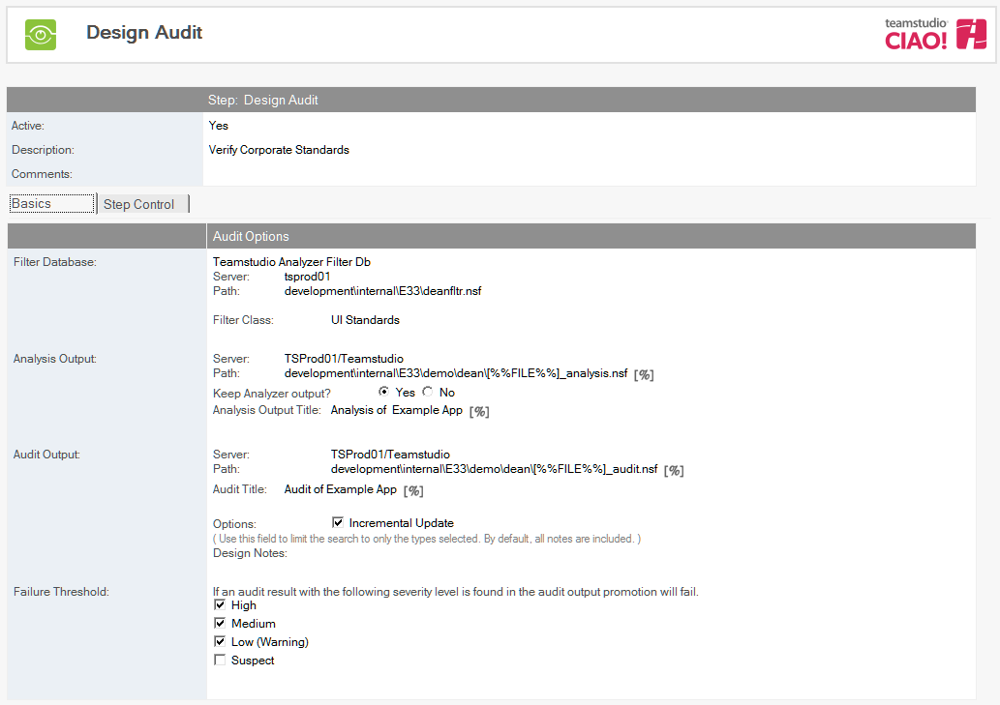
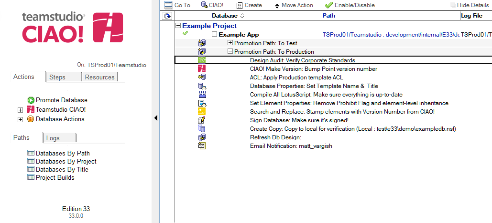

# 設計の監査

Teamstudio CIAO! を使用して 1 つ以上のデータベースの設計の監査を設定します。

注記: このアクションを実行するには、昇格を実行する各ワークステーションにライセンス版のTeamstudio Analyzer がインストールされていることに加えて、選択したフィルタデータベースへの読者アクセスが必要です。 
 
## 設計の監査を設定するには:  
1. 監査するデータベースまたはテンプレートに関するビルドもしくはプロモーションパスを選択します。
2. [作成]ボタンをクリックし[設計の監査]を選択します。  
   
3. 設計の監査文書はデフォルトで有効です。この設定は変更しないでください。
4. わかりやすい名前を [説明] フィールドに入力します（「社内基準」など）。
5. [参照] ボタンをクリックして、フィルタデータベースを選択します。
6. フィルタクラスを選択します。
7. 分析結果データベースを定義します。 
    1. サーバー名を選択します。
    2. パスを入力します。
    3. 昇格が完了後にAnalyzer の出力を維持する場合は、[ はい] を選択します。
    4. 分析結果のタイトルを入力します。 
8. 監査結果データベースを定義します。
    1. サーバー名を選択します。 パスを入力します。
    2. 監査結果のタイトルを入力します。
    3. Analyzer を前回実行してから変更された設計要素だけを分析する場合は、[増分アップデート] を選択します。修正された設計要素に対応する文書だけが更新されます。
    4. 監査する設計要素を指定します。 設計要素を指定しない場合は、すべての設計要素が監査されます。
9. ビルドプロセスの間で、高・中いずれかの重要度の警告があった際にビルドプロセスを失敗としたい場合は失敗のしきい値をチェックします。 
 
新しい [ 設計の監査] エントリが右側のペインの適用先データベースの下に表示されます。
<figure markdown="1">
  
</figure>
