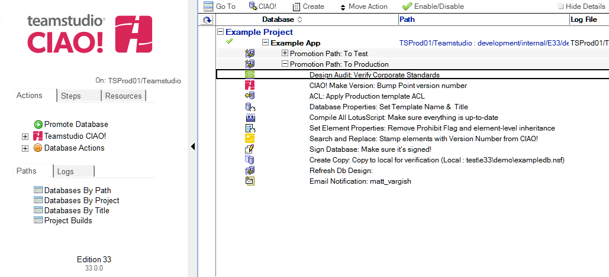

# Design Audit

Use Teamstudio Build Manager to configure a design audit for one or more databases.

**Note**: This action requires that a licensed copy of Teamstudio Analyzer is installed on each workstation that is performing a promotion and Reader access to the selected filters database. 
 
## To configure a design audit: 
1. Select the Build or Promotion Path that relates to the database or template you want to audit.
2. Click the Create button and select Design Audit.  
   
3. The Audit Design document is active by default. Leave this setting.
4. Enter a descriptive name in the Description field (for example, Corporate Standards).
5. Click the Browse button and select a filter database.
6. Select a filter class.
7. Define the analysis output database. 
    1. Select the server name.
    2. Enter the path.
    3. Select Yes if you want to keep Analyzer output after the promotion has completed.
    4. Enter the analysis output title. 
8. Define the audit output database.
    1. Select the server name. Enter the path.
    2. Enter the audit output title.
    3. Select Incremental Update to analyze only those design elements that have changed since Analyzer was last run against them. Only the documents corresponding to modified design elements are updated.
    4. Specify the design elements you want to audit. If you do not specify one or more design elements, all design elements are audited.
9. Check the Failure Threshold box if you want the build process to fail if any high or medium priority warnings are discovered during the build process. 
 
The new Design Audit entry appears in the right pane, under the Build or Promotion Path to which it applies. 
<figure markdown="1">
  
</figure>
