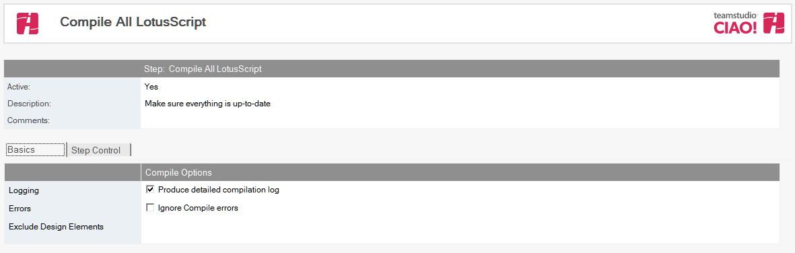
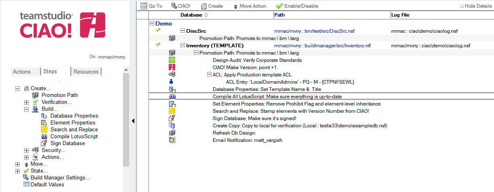

# Compile LotusScript

Use Teamstudio CIAO! to compile LotusScript. 

## To Compile LotusScript:
1. Select the **Promotion Path** that relates to the database or template for which you want to compile the LotusScript.
2. Click the **Create** action button and select **Compile LotusScript**. The Compile LotusScript document appears:  
   
3. The Compile All LotusScript document is active by default. Leave this setting.
4. Enter a descriptive name in the Description field (for example, LotusScript Compile).
5. The **Produce detailed compilation log** field is checked by default. Leave this setting. The **Promotion Log** document lists each element that is compiled. If an error occurs, the element is listed with the error.
6. Select **Compile all notes**, to compile all notes or select **Compile elements by Note ID**, to compile selected notes using the Note ID
7. If you selected **Compile elements by Note ID**, specify one note ID per line in hexadecimal.
 
Save and close.

The new Compile All LotusScript entry appears in the right pane, under the Build or Promotion Path to which it applies. 
<figure markdown="1">
  
</figure>
