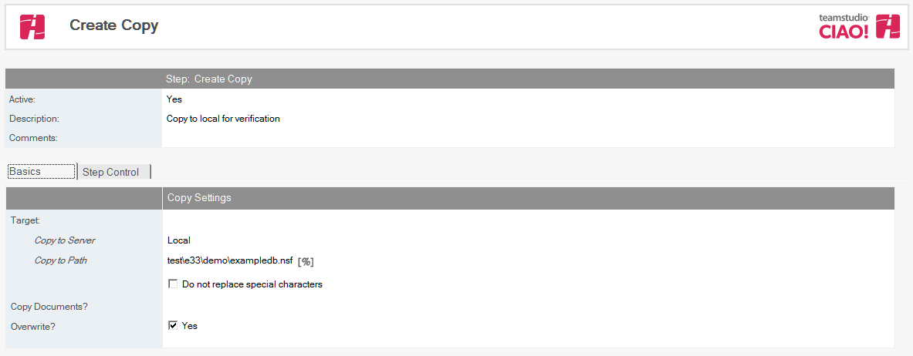
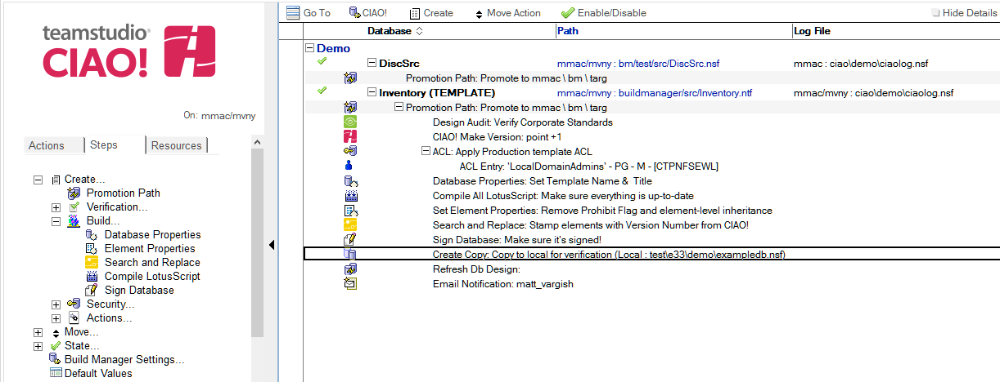

# データベースをコピー

Teamstudio CIAO! を使用してデータベースコピーを自動的に作成します。

## データベースをコピーするには:  
1. コピーするデータベースのデータベースまたはテンプレートに関するビルドもしくはプロモーションパスを選択します。
2. [作成]アクションボタンをクリックし[データベースをコピー]を選択します。  [ コピーの作成] 文書が表示されます。  
   
3. コピーデータベースの文書が表示されます。
4. [コピーの作成] 文書はデフォルトで有効です。この設定は変更しないでください。
5. わかりやすい名前を [ 説明] フィールドに入力します（「テスト用営業データベースのコピー」など）。
6. [サーバーへ昇格] のサーバー名を入力します。 このフィールドを空白にすることはできません。
7. [サーバーへ昇格] のパスを入力します。  
   注記: このフィールドは、昇格先サーバー上のデータディレクトリに相対的である必要があります。データディレクトリ自体を指定する場合は、このフィールドを空白にします。データベース名を省略した場合は、現在の名前が使用されます。
   
8. データベースまたはテンプレートと一緒に移動する文書がある場合は、[文書をコピーしますか?] フィールドにノーツ選択式（SELECT @ALL など）を入力します。
9. [ 上書きしますか?] フィールドは、デフォルトでオンになっています。この設定では、昇格するファイルの古いコピーが上書きされます。  
   この設定をオフにすると、[ 既存の場合は中止しますか?] オプションが表示されます（このオプションはデフォルトでオンです）。このオプションを使用すると、[上書きしますか?] フィールドがオフで、コピーする昇格先データベースが既に存在する場合に昇格が失敗することを指定できます。
 
文書を保存し、閉じます。

新しい [コピーの作成] エントリが右側のペインの適用先データベースの下に表示されます。 
<figure markdown="1">
  
</figure>