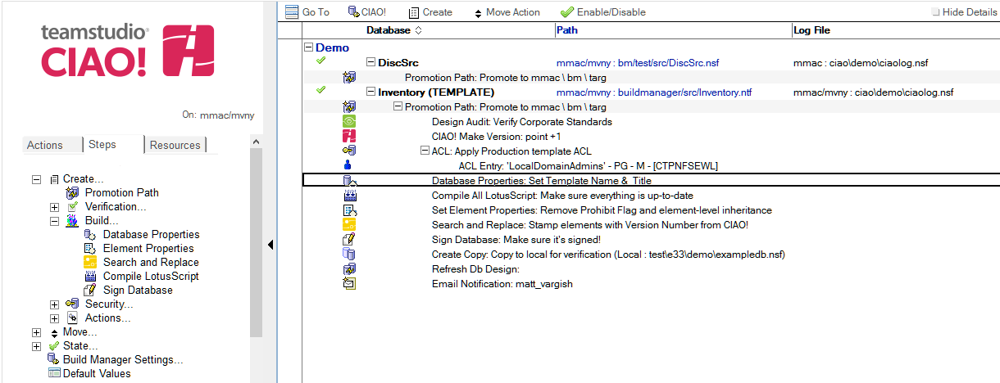

# データベースプロパティ

Teamstudio CIAO! を使用してデータベースプロパティを設定します。

## データベースプロパティを設定するには:
1. プロパティを設定するデータベースまたはテンプレートに関連するビルドもしくはプロモーションパスを選択します。
2. [作成]ボタンをクリックし[データベースプロパティ]を選択します。
3. [ データベースプロパティ] 文書が表示されます:  
   
4. [データベースプロパティ] 文書はデフォルトで有効です。この設定は変更しないでください。
5. わかりやすい名前を [ 説明] フィールドに入力します（「営業データベースプロパティ」など）。
6. Toデータベースのタイトルを変更するには [タイトル] フィールドにタイトルを入力します。このプロパティは、このアクションを実行する前にクリアできます。
7. [カテゴリ] フィールドに 1 つ以上のカテゴリを入力します。このプロパティは、このアクションを実行する前にクリアできます。
8. 現在のデータベースが継承しているテンプレート名を [継承元] フィールドに入力します。 [このプロパティをクリアする]オプションを使うことでテンプレート名を削除することもできます。
9. これがマスターテンプレートである場合は、異なったテンプレート名を入力します。
 
注記: 空白にしたフィールドの [ このプロパティをクリアする] が選択されていない場合、プロパティはプロモーションテンプレート上で変更されません。

文書を保存し、閉じます。

新しい [データベースプロパティ] エントリが右側のペインの適用先データベースの下に表示されます。  
<figure markdown="1">
  
</figure>