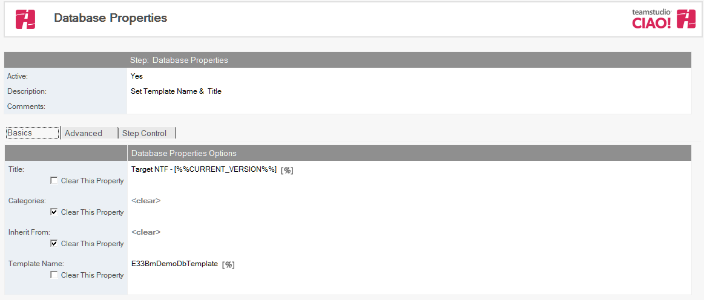
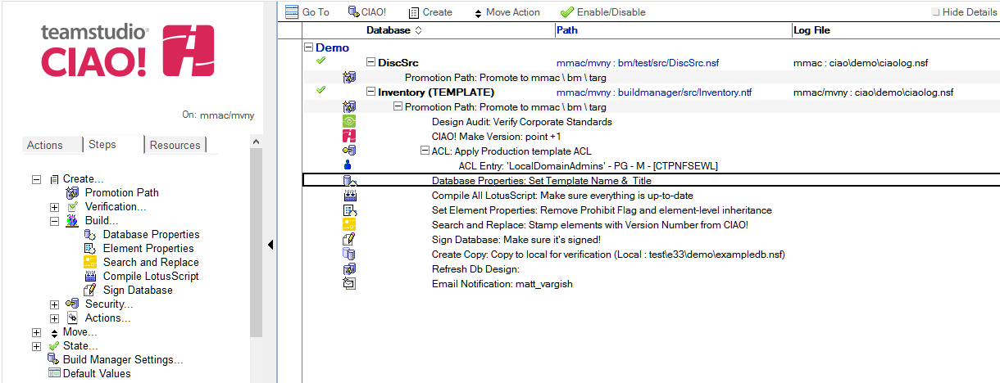

# Database Properties

Use Teamstudio CIAO! to set database properties.

## To set database properties:
1. Select the Promotion Path that relates to the database or template on which to set properties.
2. Click the Create button and select Database Properties.
3. The Database Properties document appears:  
   
4. The Database Properties document is active by default. Leave this setting.
5. Enter a descriptive name in the Description field (for example, **Update DB Title on Production Server**).
6. To modify the title of the database, enter an appropriate value into the Title field. You can clear this property prior to running this action.
7. Enter one or more categories into the Categories field. You can clear this property prior to running this action.
8. Enter a template name from which the current database inherits, into the Inherit From field. The template name can also be removed using the ‘Clear This Property option
9. Enter a different Template name if this is a master template.
 
**Note**: If a field is blank and ‘Clear This Property’ is not checked then no changes are imposed and the field keeps its original value.

Save and close the document.

The new Database Properties entry appears in the right pane, under the Build or Promotion Path to which it applies. 
<figure markdown="1">
  
</figure>