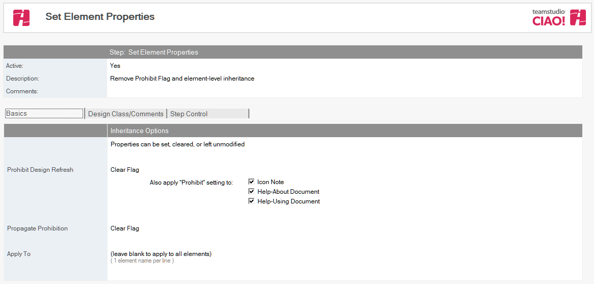
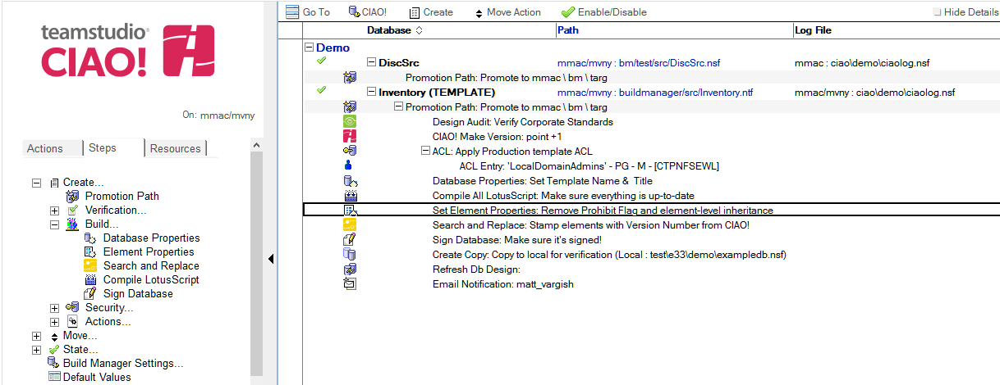

# Element Properties

Element Properties allows you to change certain Design Element properties during the promotion. 

## To configure/set Element Properties step:
1. Select the **Promotion Path** that relates to the database or template for which you want to edit the element properties.
2. Click the **Create** action button and select **Element Properties**. The Element Properties document appears:  
   
3. The Element Properties document is active by default. Leave this setting.
4. Enter a descriptive name in the Description field (for example, Edit element properties).
    * On the Basic tab the following properties can be changed:
    * **Prohibit Design Refresh** – affects ‘Prohibit design refresh or replace to modify” on the elements’ design properties.
    * **Propagate Prohibition** – Affects “Propagate this prohibition of design change” on the elements’ design properties.
    * **Apply To** – List the elements that the changes will be applied to.  
      **Note**: Leave this field blank to apply to all elements.
5. On the Design Class/Comments tab the following properties can be changed:
    * **Design Element Inheritance** – Affects “Inherit from the design template” on the elements properties.
    * **Design Element Comment** – Modifies any “Comment” field on the design element. 
 
 
Save and close.

The new Element Properties entry appears in the right pane, under the Build or Promotion Path to which it applies. 
<figure markdown="1">
  
</figure>
