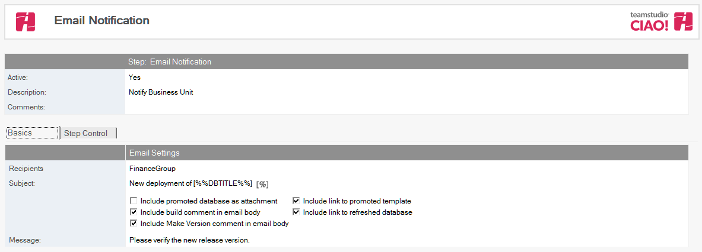
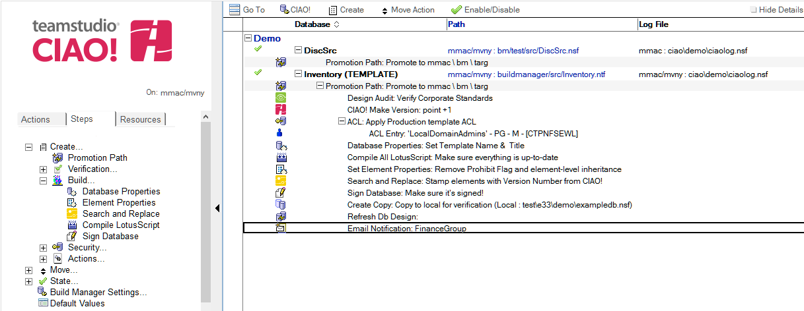

# メール通知

Teamstudio CIAO! を使用してメール通知を設定します。

## メール通知を設定するには: 
1. 人もしくはグループに昇格が成功したときにメール通知を行いたいデータベースまたはテンプレートに関するビルドもしくはプロモーションパスを選択します。
2. **[作成]**アクションボタンをクリックし**[メール通知]**を選択します。**[メール通知]** 文書が表示されます:  
   
3. [メール通知] 文書はデフォルトで有効です。この設定は変更しないでください。
4. わかりやすい名前を [ 説明] フィールドに入力します（「ステータスレポート」など）。
5. **[受信者]** フィールドのドロップダウンをクリックして、このデータベースが対象となるサーバーに昇格されたときにメール通知を送信するユーザーをアドレス帳から選択します。
6. メール通知の [件名] フィールドに表示する件名を [件名] フィールドに入力します（**「新規テンプレートをQA へ移動しました。」**など。
7. ビルドプロセスの前の手順に基づいて次のオプションから選択します。
    * [昇格データベースを添付ファイルとして含める]
    * [メール本文にビルドコメントを含める]
    * [メール本文にバージョン作成コメントを含める]
    * [昇格テンプレートへのリンクを含める]
    * [更新データベースへのリンクを含める]
8. メール通知のメッセージ本文を [ メッセージ] フィールドに入力します（「このデータベースのテストを行ってください。」など）。
 
注記: メール通知には、CIAO! レポートへの文書リンクおよび使用されたプロモーションパスが含まれます。CIAO! レポートには、昇格で行われた詳細な手順が記載されます。このレポートは、Teamstudio CIAO! データベースにも保存されます。
 
文書を保存し、閉じます。

新しい [メール通知] エントリが右側のペインの適用先データベースの下に表示されます。 
<figure markdown="1">
  
</figure>