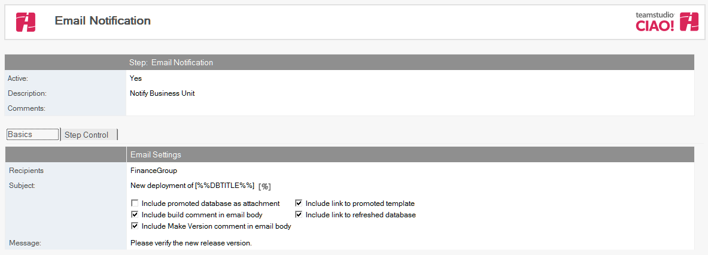
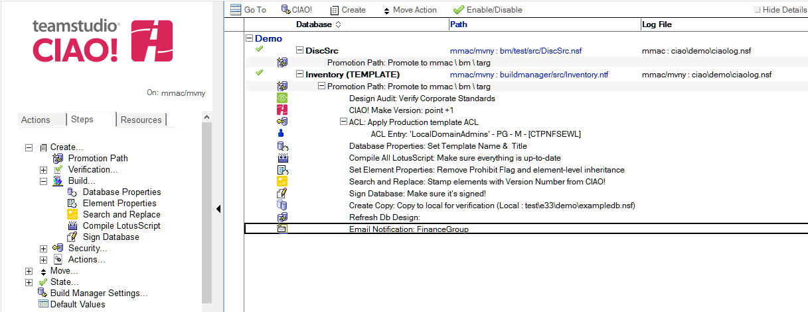

# Email Notification

Use Teamstudio CIAO! to setup e-mail notification.

## To set email notification: 
1. Select the Promotion Path that relates to the database or template for which you want to notify people or groups, via email, that the promotion was a success. 
2. Click the **Create** action button and select **Email Notification**. The Email Notification document appears:  
   
3. The Email Notification document is active by default. Leave this setting.
4. Enter a descriptive name in the **Description** field (for example, **Status Report**).
5. In the **Recipients** field, click the dropdown to select names from the address book to send email notification to, upon successful promotion of this database to the target server.
6. In the **Subject** field, enter the subject you want to appear in the Subject field in the email notification (for example, **New template has been moved to QA**).
7. Select from among the following options, based on earlier steps in the build process:
    * Include promoted database as attachment
    * Include build comment in email body
    * Include Make Version comment in email body
    * Include doc link to promoted template
    * Include doc link to refreshed database(s)
8. In the Message field, enter the body of the email notification (for example, Please test this database).
 
**Note**: The email notification contains document links to the CIAO! report and the promotion path used. The CIAO! report details the steps taken during the promotion. It is also saved in the Teamstudio CIAO! database.
 
Save and close the document.

The new Email Notification entry appears in the right pane, under the Build or Promotion Path to which it applies. 
<figure markdown="1">
  
</figure>