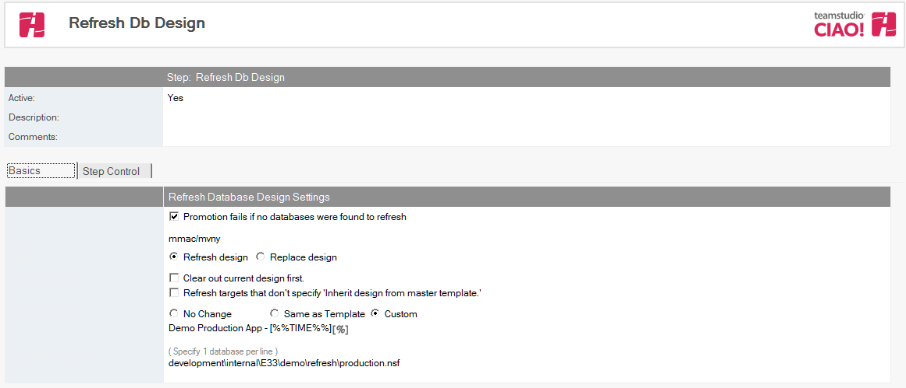
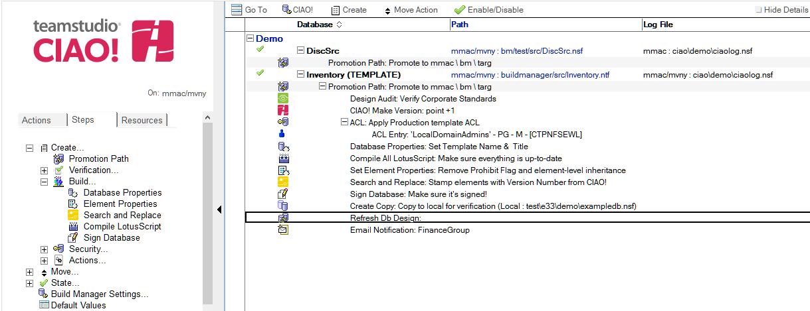

# Refresh/Replace Database Design

Use Teamstudio CIAO! to refresh the design of a database or list of databases.

## To set refresh/replace the design of a database: 
1. Select the **Promotion Path** that relates to the database or template for which you want to automatically refresh the design.
2. Click the **Create** action button and select **Refresh Design**. The Refresh Db Design document appears:  
   
3. Enter a descriptive name in the Description field (for example, **Refresh Design List**).
4. Select the **Promotion fails if no databases were found to refresh** option to cause the promotion to fail if no databases are found to refresh.
5. For **Target Server**, select the server on which to refresh databases.
    * If the CIAO! administrator has setup refresh restrictions, this field only lists the target server for the promotion or allow you to select an allowed server.
6. For mode, select either **Refresh design** or **Replace design**.
    * **Refresh design** - If you do not select **Clear out the current design first**, CIAO! refreshes changed design elements by calling Note's Design Refresh API. Otherwise, all elements in the target design will be deleted prior to the Refresh.
    * **Replace design** - If you do not select Respect ‘No Refresh’ options in the target database, CIAO! deletes all elements in the target database, and then adds all the elements from the template to the database by calling Note's Design Refresh API.  Otherwise, any elements that have Respect ‘No Refresh’ options in the target database are not deleted.
7. In the **Set Database Title** field, select:
    * **No Change** - to retain the current database title
    * **Same as Template** - to use the same title as the template that you are refreshing from
    * **Custom** - Enter the new name
8. In the **Databases to Refresh** field, enter the path of each database that requires refreshing once the template has been moved to the target server. **Wildcards** can be used to specify targets, for example, **mail\\\*** will refresh all files in the "mail" directory.  The wildcard syntax is the same as the LotusScript **Like** statement.

!!! note
    **Design Replace** and the **Design Refresh** option **Clear out the current design first** are ***destructive*** operations and will permanently remove design in the target databases before replacing it. This is safe under many circumstances but can have unintended side-effects. For example, using Replace Design on a database that relies on **Folder** design elements will delete and replace the folders in the design, thereby deleting the current folder references to document, so that all folders will be empty after the refresh. For **Replace Design**, this behavior differs than the Replace Design option in the Notes client, which does not clear out design, but simply changes the template name and performs a Design Refresh from the new template. Teamstudio recommends using **Design Refresh** without the option **Clear out the current design first** unless the specific situation merits clearing design first.
 
Save and close the document.

The new Refresh Design entry appears in the right pane, under the Build or Promotion Path to which it applies. 
<figure markdown="1">
  
</figure>