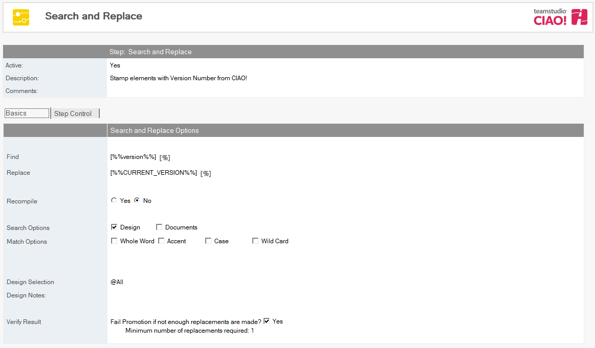

# 検索と置換

CIAO! を使用して、データベースでの検索と置換を実行します。

注記: このアクションを実行するには、昇格を実行する各ワークステーションにライセンス版の Teamstudio Configurator がインストールされている必要があります。
 
## 検索と置換を実行するには:  
1. テキストの検索と置換を実行するデータベースまたはテンプレートに関するビルドもしくはプロモーションパスを選択します。
2. [作成]ボタンをクリックし[検索と置換]を選択します。 [検索と置換] 文書が表示されます。  
   
3. [検索と置換] 文書はデフォルトで有効です。この設定は変更しないでください。
4. わかりやすい名前を [ 説明] フィールドに入力します（「Emailアドレスの置換」など）
5. 検索するテキストを [ 検索文字列] フィールドに入力します（「testers@teamstudio.com」など）。  
   注記: 青いパーセント記号（%）は、そのフィールドで置換マクロを使用できることを示します。青いパーセント記号をクリックすると、すべてのオプションが表示されます。例えば、検索された文字に対して %%version%% に置換マクロを指定すると CIAO! のバージョン番号に置換します。3-3 ページの「置換マクロ」を参照してください。
6. 置換するテキストを [ 置換文字列] フィールドに入力します（「users@teamstudio.com」など）。
7. 置換が完了した後にコンパイルを行うかどうかを指定します（[はい] または [いいえ]）
8. 検索オプションを選択します（[ 設計] または [ 文書]、あるいはその両方）
    1. 設計で検索する場合は、設計全体に 「@All」と入力するか（デフォルト）、別の基準を入力します。
    2. 文書で検索する場合は、[ ビュー] または [ 式] を指定します。選択したオプションに応じてビューまたは式を指定します。
9. 1 つ以上の一致オプションを選択します。  
   <table><tr><th>一致オプション</th><th>説明</th></tr>
     <tr><td>全単語の一致</td><td>検索文字列がスペース、句読点で囲まれている文字列が完全に一致する</td></tr>
     <tr><td>大文字小文字を区別</td><td>検索文字列が大文字小文字の区別をして検出され一致する</td></tr>
     <tr><td>濁点/半濁点を区別</td><td>濁点および半濁点が区別されます。たとえば、「ば」「ぱ」「は」を含む場合は、それぞれ別の文字列と見なされます。<td></tr>
     <tr><td>ワイルドカードを使用</td><td>ワイルドカード文字(*) を使用すると、最初のスペースまでの任意の文字列が検索対象になります。 ワイルドカード文字(?)を使用すると、最初のスペースまでの 1 文字が検索対象になります。</td></tr>
   </table>  
   検索と置換に関する詳細情報は Configurator のユーザーガイドをご参照ください。
 
もし置換のしきい値が十分に行われなかった場合にビルドを失敗としたい場合は[検索結果]のチェックボックスをチェックします。

新しい [検索と置換] エントリが右側のペインの適用先データベースの下に表示されます。 
<figure markdown="1">
  
</figure>