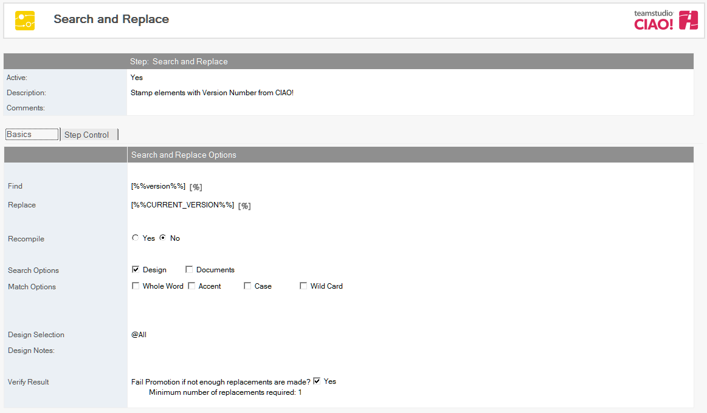
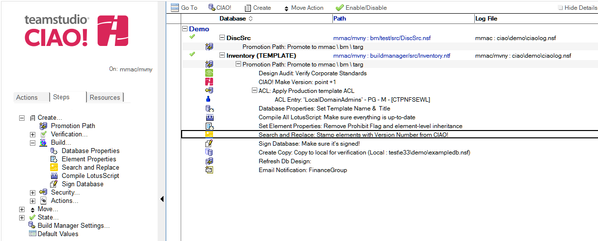

# Search and Replace

Use CIAO! to perform a search and replace in a database.

**Note**: This action requires that a licensed copy of Teamstudio Configurator is installed on each workstation that is performing a promotion. 
 
## To create a search and replace step: 
1. Select the Build or Promotion Path that relates to the database or template in which you want to search and replace text.
2. Click the Create button and select Search and Replace. The Search and Replace document appears  
   
3. The Search and Replace document is active by default. Leave this setting.
4. Enter a descriptive name in the Description field (for example, change email address).
5. Enter the text you want to find into the Find field (for example, testers@teamstudio.com).  
   **Note**: The blue percent sign (%) indicates that you can use replacement macros in this field. Click the blue percent sign to view options. For example, a macro could be used to replace a specific string like %%version%% with the current CIAO! version number.
6. Enter the text you want to replace it with into the Replace field (for example, users@teamstudio.com).
7. Specify if you want to recompile after the replacement is complete (Yes or No)
8. Select a search option (Design and/or Documents).
    1. If you want to search by design, enter **@All** for the entire design (default) or enter another criterion.
    2. If you want to search by document, specify View or Formula. In either case, specify the view or the formula.
9. Select one or more Match options.  
   <table><tr><th>Match Option</th><th>Description</th></tr>
     <tr><td>Whole Word</td><td>Matches the search string if the match string is surrounded by spaces or punctuation</td></tr>
     <tr><td>Case</td><td>Matches the search string only if the case of the search string matches the found string</td></tr>
     <tr><td>Accent</td><td>Matches the search string only if the found string has the same accenting (for example, à ä ç é, ë ï ô)<td></tr>
     <tr><td>Wild Card</td><td>Perform a wildcard search. The * wildcard character specifies 0 to n occurrences of any character, until a white-space character is encountered. The ? wildcard specifies any single character, until a white-space character is encountered.</td></tr>
   </table>  
   See the Configurator User Guide for more information about searching and replacing
 
Check the Verify Result box if you want the build to fail if a threshold of replacements is not made.

The new Search and Replace entry appears in the right pane, under the Build or Promotion Path to which it applies. 
<figure markdown="1">
  
</figure>