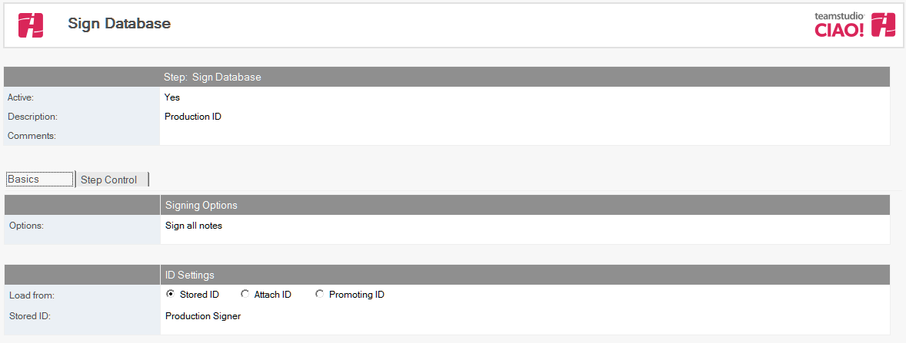

# データベースやテンプレートに署名

Teamstudio CIAO! を使用してデータベースへの署名を自動化します。

## 昇格されたテンプレートに署名するには: 
1. 署名するデータベースもしくはテンプレートに関するビルド、もしくはプロモーションパスを選択します。
2. [作成]アクションボタンをクリックし[データベースを署名]を選択します。 [ データベースを署名] 文書が表示されます。  
   
3. [データベースを署名] 文書はデフォルトで有効です。この設定は変更しないでください。 わかりやすい名前を [説明] フィールドに入力します（**「データベースの署名」**など）。
4. **[格納 ID]** または **[ID の添付]** のいずれかをオンにします。
    * **[格納 ID]** を選択した場合は、[格納 ID] ドロップダウンをクリックして、リストから格納 ID を選択します。
    * **[IDの添付]** を選択した場合は、データベースを次のサーバーに移動したときに署名を行うために必要なIDのID ファイルを参照して添付します。添付ID の [パスワード] フィールドを使用して、パスワードを指定する必要もあります。
5. 次のオプションから選択します:
    * [すべての要素を署名する]
    * [タイトルで指定された要素を署名する] - 行ごとに 1 つの要素を指定します。
    * [Note IDで指定された要素を署名する] - 16 進法を使用して行ごとに 1 つの要素を指定します。
    * [エージェントとスクリプトライブラリを署名する]
    * [上記のIDで署名されていない要素を署名する]
 
文書を保存し、閉じます。

新しい [データベースを署名] エントリが右側のペインの適用先データベースの下に表示されます。
<figure markdown="1">
  
</figure>