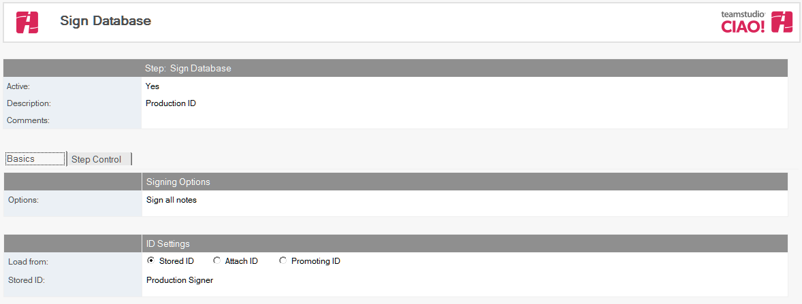
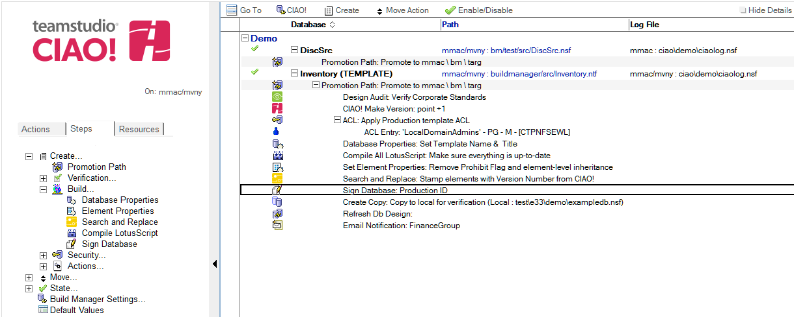

# Sign Database or Template

Use Teamstudio CIAO! to automate database signing.

## To sign the promoted template: 
1. Select the **Promotion Path** that relates to the database or template which you want to sign
2. Click the **Create** action button and select **Sign Design**. The Sign Database document appears:  
   
3. The Sign Database document is active by default. Leave this setting. Enter a descriptive name in the Description field (for example, **Sign DB with Production ID**).
4. Check either **Stored ID** or **Attach ID**.
    * If you select **Stored ID**, click the Stored ID dropdown to select a stored ID from the list.
    * If you select **Attach ID**, browse to attach the ID file of the ID required to sign the database once it has been moved to the next server. You must also specify a password using the Password field for the attached ID.
5. Select from the following options:
    * Sign all notes
    * Sign elements by title - specify one element per line
    * Sign elements by Note ID - specify one element per line using hexadecimal
    * Sign Agents and Script Libraries
    * Sign notes not signed by the above ID
 
Save and close the document.

The new Sign Database entry appears in the right pane, under the Build or Promotion Path to which it applies. 
<figure markdown="1">
  
</figure>