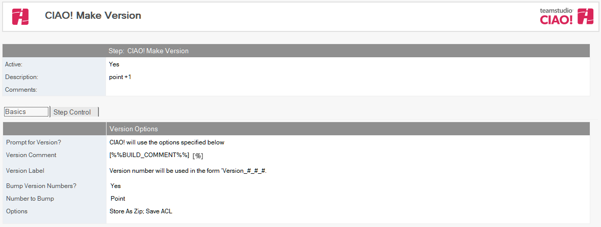
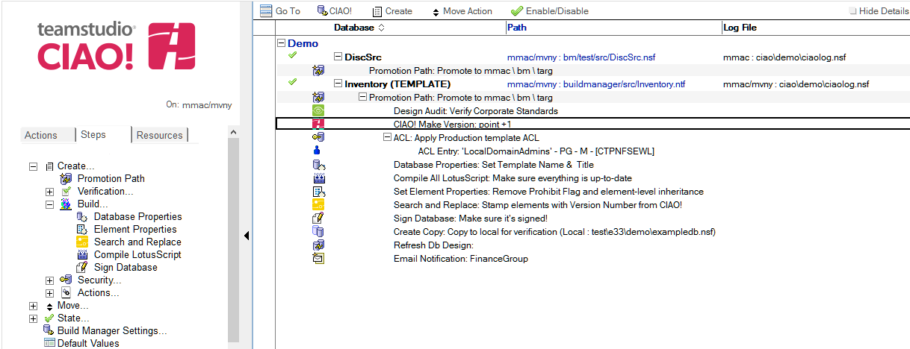

# バージョン作成 (CIAO!)

Teamstudio CIAO! を使用してバージョン作成を自動化します。

注記: この手順を実行するには、昇格を実行するワークステーションに Teamstudio CIAO! がインストールされている必要があります。  
 
## バージョンを作成するには:  
1. バージョン作成の手順に追加するプロモーションパス文書を選択します。
2. [作成]ボタンをクリックし[バージョン作成]を選択します。
3. [バージョン作成] 文書が表示されます。  
      
4.  [バージョン作成] 文書はデフォルトで有効です。この設定は変更しないでください。
5.  わかりやすい名前を [ 説明] フィールドに入力します（「最終バージョン」など）。
6.  ユーザーの介入を求めず、指定されているバージョンコメントとラベル、バージョン番号を昇格するかどうかの設定、および使用オプション（[ZIP ファイルで保存]、[文書を保存]、[ACL を保存]、または [複製設定を保存]）の設定をしようする場合は、［CIAO コメントとラベルのプロンプトを表示する］ オプションをオフにします。昇格ごとに [バージョン作成] ダイアログボックスでの確認を行う場合は、このオプションをオンにします。

注記: これらのフィールドの詳細については、Teamstudio CIAO! マニュアルを参照してください。

文書を保存し、閉じます。新しい [ バージョン作成] エントリが右側のペインの適用先データベースの下に表示されます。
<figure markdown="1">
  
</figure>

