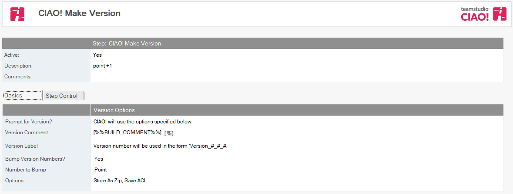

# Make Version with CIAO!

Use Teamstudio CIAO! to automate version creation.

**Note**: This requires that Teamstudio CIAO! be installed on the workstation that is performing the promotion. 
 
## To create a Make Version step: 
1. Select the Promotion path document to which you want to add the Make Version step.
2. Click the Create button – Make Version
3. The Make Version document appears.  
      
4.  The Make Version document is active by default. Leave this setting.
5.  Enter a descriptive name in the Description field (for example, Gold Version).
6.  Uncheck the CIAO should prompt for the comment and label option if you want to promote without user intervention, using the specified version comment and label, whether to bump version numbers, and which options to use (Store As Zip, Save Documents, Save ACL or Save Replication Settings). Leave this option selected if you want CIAO! to prompt you for the version number with the tool's Make Version dialog box for each promotion. 

**Note**: Refer to the Teamstudio CIAO! documentation for more information on these fields.

Save and close the document.

The new Make Version entry appears in the right pane, under the Build or Promotion Path to which it applies.
<figure markdown="1">
  
</figure>

