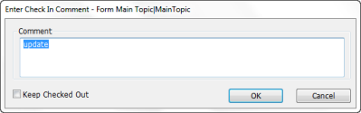
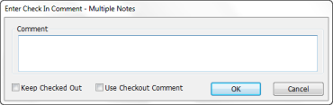
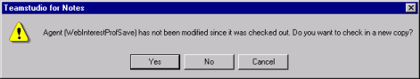
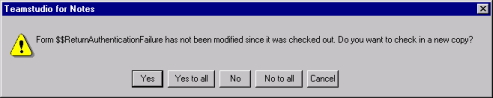

# 要素のチェックイン
要素をチェックアウト可能にするには、要素をチェックインします。要素 をチェックインすると、要素のコピーがログデータベースに保存されます。 これにより、後でその変更にロールバックすることが可能になります。要 素をチェックインするたびに、CIAO! により次のデータが保存されます。

* 問題
* チェックインする要素のコピー
* 要素に添付するコメント
* チェックインしたユーザーのレコード
* チェックインが行われた日時

## 1 つの要素のチェックイン
チェックアウトコメントを入力した後で、1 つの要素だけをチェックインす る場合は、このコメントがデフォルト値として使用されます。

## 設計要素をチェックインするには
1. Designer で、作業するデータベースを開きます。
2. ツールバーの[CIAO!]ボタンをクリックします。  
   変更された設計要素は、メインウィンドウのデフォルトでは青色で表示されます。
3. チェックインする設計要素を選択します。
   

     
Note

     
ノーツ 8.5.1 以降を使用している場合、Designer で開いた要素が CIAO! により自動的に認識されて、強調表示されます。

   

4. **[CIAO!]** メニューから、**[ チェックイン ]** を選択します。[ チェックインコメントの入力 ] ウィンドウが表示されます。
   
5. チェックインコメントを入力し、**[OK]**をクリックします。

!!! note
    チェックインする要素を選択し、[CIAO!] メニューから [ チェックイン ] を選択すると、同時に複数の要素をチェックインすることができます。  
    カテゴリ別表示でないビューを使用している場合、複数の要素を同時に 選択するには、CTRL または Shift キーを押しながら選択します。チェッ クアウトした要素すべてをチェックインするには、CIAO! メインウィン ドウにある [ ユーザー ] 列をクリックします。これにより、要素がユー ザー名(該当要素をチェックアウトしたユーザーの名前)のアルファベッ ト順に並べ替えられ、現在自分がチェックアウトしている要素すべてを 簡単に選択することができます。  
    カテゴリ別表示ビューを使用している場合、複数の要素を選択するには、 要素のチェックボックスをオンにして選択します。

1 回で 1 つをチェックインするよりも、複数の要素を選択してからチェック インした方が簡単なことがあります。複数の要素をチェックインする場合、 次のウィンドウが表示されます。 
<figure markdown="1">
  
</figure>

**[ チェックアウトし続ける ]** チェックボックスをオンにすると、新しいバー ジョンを作成した後、そのバージョンをチェックアウトした状態にしてお くことができます。これは、変更内容を保存した後も、同じ要素での作業 を続ける場合に役立ちます。

**[ チェックアウトコメントを使用する ]** チェックボックスを、チェックアウ トコメントをチェックインコメントとして使用できます。

!!! note
    複数の要素をまとめてチェックインしている場合、チェックアウトコメントは デフォルトのチェックインコメントとして表示されません。
 
複数の要素をチェックインするときに、変更していない要素が含まれてい ると、メッセージが表示されて、**[ すべて置換 ]** と **[ すべて維持 ]** という 2 つ のオプションが追加されます。要素を個別にチェックインしない場合は、これらのボタンのいずれかをクリッ クしてください。

!!! note
    **[ すべて維持 ]** ボタンをクリックすると、変更されていない要素のみがす べて維持されます。 
    
## 変更されていない設計要素をチェックインするには
要素は、変更していない場合でもチェックインできます。チェックアウト からチェックインまでの間に、設計要素が変更されていない場合は、新しいコピーをチェックインするかどうか(つまり、新しくバージョンを作成するかどうか)確認するプロンプトが表示されます。
<figure markdown="1">
  
</figure>

複数の要素をチェックインしようとすると、同様のメッセージが表示され ます。
<figure markdown="1">
  
</figure>

* 要素をチェックインして、前のバージョンとまったく同じ要素の新しいバー ジョンを作成する場合は、[ はい ] または [ すべてはい ] をクリックします。
* 新しいバージョンを作成せずに要素をチェックインする場合は、[ いいえ ] また は [ すべて維持 ] をクリックします。
* チェックインをキャンセルして、要素をチェックアウトしたままにするには、 [ キャンセル ] をクリックします。